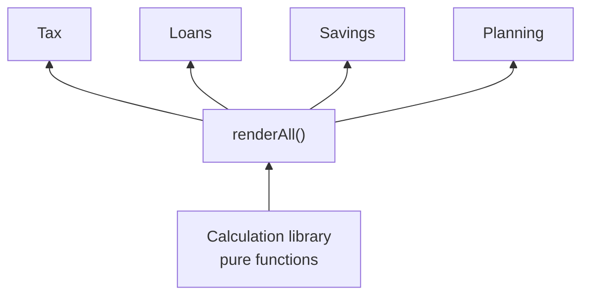
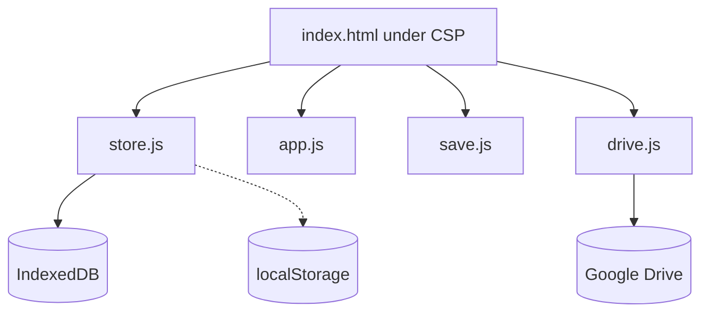

# FinSim — Project Proposal

**Malaysia Money Calculators**

23 September 2026 · Kaon · Revision 3

*A formatted edition of this proposal, with a cover page, contents and diagrams, sits beside it as [FinSim-Project-Proposal.docx](FinSim-Project-Proposal.docx) and [FinSim-Project-Proposal.pdf](FinSim-Project-Proposal.pdf). This Markdown file is the source; the two are generated from it.*

## Executive summary

FinSim is a set of thirteen Malaysian money calculators on one web page — payslip to retirement — computed from KWSP, LHDN and PERKESO rules rather than generic overseas formulas. There is no server, no account and no monthly fee. A working build is already live at [kaonhew02.github.io/FinSim](https://kaonhew02.github.io/FinSim/), carrying all thirteen calculators across 11,057 lines of hand-written HTML, CSS and JavaScript with no framework and no runtime dependency. Since 22 September 2026 it also runs under a strict Content-Security-Policy and rebuilds every imported or Drive file from scratch before a byte of it is trusted.

The product exists because the calculators people already use get the arithmetic right and the statute wrong — and the ones that get the statute right answer one question and stop, so the net pay a bank divides by has to be worked out again by hand.

|  |  |
| --- | --- |
| Product | FinSim — *Simulate your financial future.* |
| Category | Personal-finance calculators and planning simulator |
| Primary user | A Malaysian salaried adult working out their own money in ringgit |
| Delivered | 13 of 13 calculators live; autosave, named scenarios, Export/Import and an optional Google Drive copy |
| Rules built in | YA 2026 — LHDN brackets and 23 reliefs, EPF Third Schedule, PERKESO SOCSO and EIS tables, Stamp Act tiers |
| Stack | Static site on GitHub Pages · IndexedDB · optional Google Drive copy |
| Security | Strict Content-Security-Policy · every import rebuilt and validated · SRI on the one CDN stylesheet |
| Dependencies | No framework, no npm package at runtime, no API key; the build step is optional |
| Running cost | RM 0/month — hosting, storage and backup are all free tiers or the reader's own disk |
| Effort to date | 25 commits, 17 Aug 2026 – 23 Sep 2026 |
| Proposed next phase | 10 weeks: a committed test suite, rules keyed by year of assessment, offline install, two new modules |

**The ask.** Approval to run the ten-week Phase 4 in [Project plan and timeline](#project-plan-and-timeline) at the resourcing set out in [Resources and budget](#resources-and-budget) — one developer, part-time (\~100 hours), and RM 0 committed.

## Background and problem statement

The problem is not that money calculators do not exist — every bank has one on its website. It is that each of them answers one question, for one product, on somebody else's assumptions, and none of them agrees with the next. A payslip calculator will not hand its net figure to a debt-service calculator; a loan calculator does not know what the stamp duty on the house will be; a retirement calculator does not know that EPF credits a dividend weighted by the months the money was held.

FinSim began on 17 August 2026 as thirteen calculators written against Malaysian rules from the first line. Persistence arrived on 20 August, the mobile layout on 21 August, and a security hardening on 22 September after a crafted backup file was shown to run its own code in the page.

### What the alternatives get wrong

| Option | What it costs the user |
| --- | --- |
| A bank's own calculator | One product, one bank's assumptions, and built to sell that loan rather than compare it |
| Generic online calculators | EPF at a flat 11%, monthly tax as annual tax ÷ 12, car loans on a reducing balance — the arithmetic is right and the statute is not |
| Payroll calculators | Accurate for the payslip, but a payslip is one question of thirteen and the net figure goes nowhere |
| Planning apps with accounts | Salary, debts and net worth handed to someone else's server to get an answer |
| A spreadsheet | Private and flexible, but every statutory table is re-typed by hand and one wrong cell is silent |

### The Malaysian gap

International tools are built for other people's payslips. EPF is not 11% of salary: the Third Schedule takes the wage to the top of its RM 20 band and rounds the contribution **up** to the ringgit. SOCSO and EIS come from PERKESO tables with a RM 6,000 ceiling. Monthly tax is LHDN's annualised MTD, with a bonus taxed separately as additional remuneration in the month it is paid. A car is bought on hire purchase, which is flat-rate under the Hire-Purchase Act 1967 — so the effective rate is roughly **double** the one on the quote — and settling early returns only the Rule of 78 rebate, barely a quarter of the charges halfway through a seven-year loan. A house carries MOT stamp duty in four tiers, 0.5% on the loan agreement, the solicitors' remuneration scale charged twice, and 8% SST on top. EPF has been three accounts since May 2024. None of that is a setting in a foreign calculator.

### The design flaw underneath all of it

Every standalone calculator re-derives the figures it needs, so two calculators on the same salary disagree the moment one of them rounds differently. And most of them state their answer to the sen with no word about what they assumed, so a thirty-year projection reads as a prediction rather than a direction. FinSim's founding constraint is the opposite on both counts: **one calculation library, used by every module, and every assumption stated on screen.**

## Proposed solution

FinSim is thirteen calculators sharing one calculation library, delivered as a static web page that keeps every figure on the reader's own machine. There is no account to create, no server to trust and nothing to cancel.

### One library, thirteen answers

The top \~1,000 lines of `app.js` are pure functions with no DOM access, and every module calls them rather than keeping its own copy of a rule. The DSR calculator runs gross salary through **the PCB module's own statutory stack** — `epfContribution`, `socsoContribution`, `eisContribution`, `calculatePcbTax` — to reach the net figure a bank divides by. The retirement calculator runs the compound-interest engine forward to the retirement date, then the drawdown engine from there. Rent vs Buy costs the purchase with the same `buyingCosts()` and runs the same `loanSchedule()` as the home loan.



Because the modules share one library, their answers agree with each other: the net pay on the PCB screen is, to the sen, the net pay the DSR screen divides by.

### No calculate button

Every field is bound to a single `renderAll()`, which recalculates all thirteen modules on every keystroke. The hidden ones write to elements nobody is looking at, and the whole pass takes under a millisecond. **There is no such thing as a stale answer on screen**, because there is no moment at which an input has changed and a result has not.

### Statutory tables, not percentages

Where a Malaysian authority publishes a table, FinSim reproduces the table. The payroll figures are calibrated against payroll.my for YA 2026 to the sen. Every figure a Budget can move is a named constant — `TAX_BRACKETS`, `RELIEF_GROUPS`, `SOCSO_CATEGORIES`, `EPF_ACCOUNTS`, `DSR_CAPS`, `MOT_STAMP_BANDS`, `LEGAL_FEE_BANDS` — so the annual refresh is an edit in one place rather than a hunt through the maths.

### What the user gets that they did not have

- **Answers that agree.** Thirteen calculators, one set of rules, one rounding policy.
- **Privacy by construction.** Figures never leave the browser unless the reader presses a button. There is no account, no telemetry and no key in the source.
- **Malaysian arithmetic that is actually right** — Third Schedule EPF, PERKESO tables, annualised MTD, flat-rate hire purchase with the Rule of 78, stamp duty and legal fees to the ringgit.
- **Plans side by side.** Named scenarios per calculator — *35 years at 4%* against *30 years at 4.2%*, one tap apart.
- **The assumptions, out loud.** Every module carries a note saying what it assumes and where it stops being reliable.
- **A folder you can copy.** No framework and no required build, so a double-clicked `index.html` is a working app.

## Objectives and success criteria

The project succeeds if a Malaysian can answer the thirteen questions on the sidebar with figures that match the statute, keep their plans for a year, and never hand a figure to a server. Everything below is a test, not an aspiration.

| # | Objective | Measure | Threshold | Status |
| --- | --- | --- | --- | --- |
| O1 | Statutory figures match the published tables | Payroll figures against payroll.my for YA 2026 | Exact to the sen | Met |
| O2 | The modules agree with each other | Net pay in DSR against the PCB module on the same salary | Identical | Met |
| O3 | No answer on screen is ever stale | Calculate buttons; results lagging an edited input | 0 | Met |
| O4 | The app runs with nothing installed | Framework, npm packages, build steps or API keys needed to run | 0 of each | Met |
| O5 | Nothing leaves the browser by default | Requests carrying a figure with Auto off and no button pressed | 0 | Met |
| O6 | Every module states its assumptions | Modules with an assumptions note on screen | 13 of 13 | Met |
| O7 | Plans survive a new laptop | Export → Import round trip restoring every form and scenario | Identical | Met |
| O8 | A failed write is never silent | Failed writes reported as saved | 0 | Met |
| O9 | Storage headroom | Usable capacity for records | ≥ 500 MB | Met (\~3,034 MB via IndexedDB) |
| O10 | Usable on a phone | Horizontal overflow at 375 px, any module | 0 px | Met |
| O11 | A backup file cannot run code | Script payloads executed from a crafted Import or Drive file | 0 | Met (22 Sep 2026) |
| O12 | Regressions are caught before release | Modules covered by committed tests that run on every push | 13 of 13 | **Not met** — 0 committed |
| O13 | Text is readable | WCAG AA contrast on every piece of text | ≥ 4.5:1 | Partial — quiet text at 2.63:1 |
| O14 | Opens with the network off | Installs to a home screen and starts offline | Yes | Not met |
| O15 | Rules follow the year of assessment | Constants for the year the reader's income falls in | Correct YA | Partial — YA 2026 only |

### What "done" means for Phase 4

O12 to O15 are the four open rows, and they are the whole of the proposed next phase. O12 is the one that protects every other row: without committed tests, each of O1–O11 is true today and unguarded tomorrow. O15 is the one a calendar forces — on 1 January 2027 every payslip is taxed under YA 2027 rules, and a calculator that only knows YA 2026 is wrong without having changed.

### Explicit non-objectives

These are refused on purpose, and each refusal has a reason that should survive a change of mind:

- **No accounts and no server.** Holding a reader's salary on a server is the thing the product exists to refuse.
- **No product recommendations and no bank rates quoted as fact.** Rate guidance is given as ranges, never as a named lender's offer. FinSim is a planning tool, not financial advice.
- **No invented figures.** EPF's next dividend is not predicted — the reader sets one per year. A bank's income haircut is not guessed. A number the app made up would sit on screen looking like a fact.
- **No filing.** FinSim works out what is owed; it does not submit anything to LHDN, and it never asks for a tax number.
- **No analytics.** Success is deliberately invisible, because measuring it would mean sending something from the reader's browser.

## Target users and personas

The target user is one Malaysian adult working out their own money — salaried, resident for tax, paying into EPF, and facing one of the big decisions: a first home, a car, the annual return, or whether retirement adds up. Not an adviser, not a payroll department, and not somebody who needs a binding figure.

| Persona | Situation | What they need | Lives in |
| --- | --- | --- | --- |
| **Nurul, 24 — the first payslip** | First job, RM 3,800 basic, and a net figure that is not what she expected | Every deduction explained, and what her employer pays on top | M1, M8 |
| **Jason, 29 — the first home** | Renting at RM 1,600, looking at a RM 450,000 condominium | The instalment, the entry costs to the ringgit, whether the bank will lend, and whether buying beats renting | M3, M6, M13 |
| **Priya, 33 — the car upgrade** | Quoted a flat rate over nine years on a new car, with a personal loan already running | The real rate behind the quote, and what settling early would actually save | M4, M5, M6 |
| **Wei Ling, 36 — the tax filer** | Files the BE form every April; spends on lifestyle, SSPN and her parents' medical bills | Which reliefs are worth chasing and which are already capped | M2 |
| **Faizal, 44 — the retirement check** | EPF, an ASB account and a goal of RM 5,000 a month from 60 | The fund needed, what he is on track for, and the cheapest way to close the gap | M8, M9, M10 |

One person is usually several of these over a decade, which is why they are one app and not five.

### Jobs to be done

- *When my payslip arrives, I want every deduction explained, so that I can tell whether my employer got it right.*
- *When a bank quotes me a flat rate, I want the real rate beside it, so that I can compare loans on the same footing.*
- *When I am deciding whether to buy, I want both paths costed to the stamp duty, so that the answer is not just an argument for buying.*
- *When I file my return, I want to see which relief is worth chasing, so that I do not spend to claim a relief I have already capped.*
- *When I change laptop, I want my figures and saved plans back, so that a year of planning is not retyped.*

### Who this is not for

Advisers and institutions needing a record of advice; payroll departments running many employees; non-residents and anyone under a non-Malaysian tax regime; and anyone needing a binding figure — for that, the app directs the reader to KWSP, LHDN or the bank itself.

## Scope — module breakdown

Thirteen modules in four sidebar groups, all delivered and live. Every one takes the same shape: a sticky input panel on the left, three result tiles and a distribution bar on the right, then tables that flip between yearly and monthly.

| # | Group | Module | Answers | Status |
| --- | --- | --- | --- | --- |
| M1 | Tax | PCB Calculator | What lands in my account this month? | Delivered |
| M2 | Tax | Income Tax Calculator | What do I owe for the year? | Delivered |
| M3 | Loans | Home Loan | What does the bank want every month? | Delivered |
| M4 | Loans | Car Loan | What does a flat hire-purchase rate really cost? | Delivered |
| M5 | Loans | Personal Loan | Flat or reducing, on the same rate? | Delivered |
| M6 | Loans | DSR Calculator | How much more will a bank lend me? | Delivered |
| M7 | Savings | Savings Goal | What must I set aside to have it by then? | Delivered |
| M8 | Savings | EPF Calculator | What does my EPF grow into? | Delivered |
| M9 | Savings | Compound Interest | What does regular investing turn into? | Delivered |
| M10 | Savings | Retirement Calculator | Am I on course for the life I want after work? | Delivered |
| M11 | Planning | Net Worth | Where do I actually stand? | Delivered |
| M12 | Planning | Emergency Fund | How much should be standing by? | Delivered |
| M13 | Planning | Rent vs Buy | Which leaves me better off? | Delivered |

### M1 · Tax — PCB Calculator

What actually lands in the account this month, and what the employer pays on top.

- Basic salary, bonus or allowances this month, employee EPF at 11 / 9 / 8%, employer EPF at 13 / 12%, and the SOCSO category.
- EPF is charged on salary **and** bonus; SOCSO and EIS on salary only, both capped at a RM 6,000 wage.
- **PCB uses LHDN's annualised method.** Annualise the salary, subtract the RM 9,000 individual relief and EPF relief capped at RM 4,000, tax it through the brackets, divide by 12 and round **up** to 5 sen.
- **A bonus is additional remuneration.** Tax the whole year including the bonus, subtract twelve regular MTDs, and deduct the difference in full in the month the bonus is paid.
- Only the individual and EPF reliefs apply to PCB, matching payroll.my — and the figures are calibrated against it to the sen.

### M2 · Tax — Income Tax Calculator

What is owed for the year, and which relief is actually worth claiming.

- Annual income, then any of **23 LHDN relief lines in four groups**, each with its own cap. The panel builds itself from `RELIEF_GROUPS`, so a Budget change is an edit to one table.
- Four relief types: `fixed` (granted automatically), `flag` (you qualify or you do not), `count` (per child) and `amount` (what you spent, capped).
- **Each cap is enforced on its own.** Claiming above a cap wastes the excess rather than spilling into another line, and the breakdown shows what each line actually contributed.
- Chargeable income band by band, the RM 400 rebate at RM 35,000 or less, and effective against marginal rate.

### M3 · Loans — Home Loan

What the bank asks for every month, and how much of it never touches the loan.

- Price, deposit in ringgit **or** percent (whichever was touched last leads), rate, tenure, and optionally an extra monthly payment and a one-off lump sum in a chosen year.
- `loanInstalment()` for the payment; `loanSchedule()` applies extra payments to principal, so the schedule simply ends early and the saving is shown in ringgit **and** in years.
- **Monthly rest**, the basis a letter offer is quoted on. Housing loans are charged daily, which moves each month by a few ringgit and leaves the totals within rounding.
- Margin of finance capped at 90%, tenure at 50 years. Full amortisation, yearly or monthly.

### M4 · Loans — Car Loan

Hire purchase is quoted flat. What does that instalment really cost?

- **Interest is charged on the whole original amount for the whole term** — principal × flat rate × years — regardless of how much has been repaid.
- `effectiveRate()` finds the reducing-balance rate that would demand the same instalment. There is no closed form, so it bisects 80 times — and it comes out near double the quote.
- **Early settlement uses the Rule of 78:** charges × n(n+1) / N(N+1), where n is the months left. Interest is treated as earned fastest at the start.
- Fixed-rate hire purchase under the Hire-Purchase Act 1967. Tenure capped at 9 years, margin at 90%.

### M5 · Loans — Personal Loan

An unsecured loan quoted flat: what is the instalment, and what does the rate really mean?

- Amount, tenure in years **or** months, rate, a Flat / Reducing toggle, processing fees and a settlement month.
- Both bases side by side on the same rate, so the gap is visible; the default is Flat, because that is how Malaysian banks quote.
- Total cost includes the **0.5% loan-agreement stamp duty** and fees.
- Tenure capped at 10 years. Rate guidance is written as ranges — banks 7–13% flat, public-sector schemes 3.5–5% — never as a named lender's rate.

### M6 · Loans — DSR Calculator

The module that ties the app together: how much more will a bank actually lend?

- **Gross income runs through the PCB module's own statutory stack** — EPF at 11%, SOCSO, EIS, PCB — to reach the net figure banks divide by.
- Fixed allowances in full; variable income discounted by a chosen share, 80% by default.
- Every commitment a bank can see on CCRIS: home, car, personal, PTPTN, other — and a credit card **counted at 5% of its balance** whatever the bank's own minimum is.
- DSR placed in a band from *Comfortable* to *Over-extended*; net disposable income with a verdict; the monthly room before the cap, turned into a borrowable home, car or personal loan by `maxLoanReducing()` and `maxLoanFlat()`.
- Caps — private 60%, GLC 70%, government 80% — are typical ceilings, not rules. A civil servant repaying through BPA gets the highest because the instalment is taken before the pay arrives.

### M7 · Savings — Savings Goal

What it takes every month to have the money by the time it is needed.

- Target, what is already saved, a deadline in months **or** as a date (either fills the other), expected return, and optionally *what I can actually spare*.
- `goalDeposit()` solves the annuity in one step and **rounds up to the sen**, so a goal is never missed by rounding; the final deposit is trimmed so the target is hit exactly.
- A smaller deposit shows how much later the goal arrives and how far short the deadline falls.
- The default return is 0% on purpose: for a fixed date, growth should be a bonus, not the plan.

### M8 · Savings — EPF Calculator

What goes in each month, and what it grows into by the time it can be touched.

- Salary, both rates, voluntary top-up, current balance, age, the age to project to (55 by default) and salary growth.
- The Akaun 1 / 2 / 3 split at **75 / 15 / 10**, the restructure of May 2024.
- **A dividend rate per year.** EPF declares its rate once a year and never in advance, so the projection table takes one rate for each year rather than holding a single figure flat.
- Dividends credited on the balance held through the year: the opening balance earns twelve months, each contribution only the months after it lands — 5.5/12 of a year across twelve equal contributions, the aggregate EPF itself works to.

### M9 · Savings — Compound Interest

What regular investing turns into, and how much of it is the reader's money versus the market's.

- Initial sum, monthly contribution, expected return, period, crediting frequency (monthly, quarterly, yearly) and inflation.
- **Interest accrues monthly but is only credited when the rest closes**, so money waiting for the credit date does not compound — exactly how EPF and ASB weight a dividend by the months held.
- Final value, contributions, profit, the month profit overtakes contributions, the balance in today's money, and a lever table: RM 100 more a month, 1% better, five more years, starting later.
- At monthly rests it matches the textbook annuity formula to the sen.

### M10 · Savings — Retirement Calculator

What the life wanted after work costs, and whether the current path reaches it.

- Income wanted **in today's ringgit**, other income then, age now and at retirement, how long the money must last, savings so far, monthly contribution, a return while working and a **lower** one after, and inflation.
- Two phases back to back: `compoundSchedule()` to the retirement date, then `drawdownFund()` — the present value of an inflation-rising withdrawal — for the fund needed.
- The gap closes three ways: save more (`goalDeposit()`), work longer (a break-even age searched in both directions), or want less (`drawdownIncome()` deflated back to today).
- Says how far the current path actually pays — *until age 74, 10 years short* — rather than only how big the gap is.

### M11 · Planning — Net Worth

Where the reader actually stands.

- **19 lines in five groups** — cash and bank, investments, property and vehicles against long-term and short-term debt — following AKPK's own grouping. The panel and its defaults are generated from `NET_WORTH_GROUPS`.
- Net worth, each line's share of its side, money reachable this week and how many months it covers, what is locked in EPF, and a debt-to-asset verdict.
- The asset and debt bars **share one scale**, so the gap between them is the picture.
- EPF counts in net worth but not in money reachable this week — it is real, it is just not available until 55.

### M12 · Planning — Emergency Fund

How much should be standing by before a bad month turns into a bad year.

- Eight lines of **essential** monthly spending — what cannot stop being paid, not current spending.
- A recommended cover from three questions about the household: three months to start, +2 for contract work, +3 for an own business, +1 for one income, +1 or +2 for dependants, capped at 12 — with the reasons read back as a sentence.
- Reuses the savings-goal helpers for the arrival date and the twelve-month pace.
- The default return is only 2.5%, because the money must be reachable the same day — an emergency fund is insurance you happen to own, not an investment.

### M13 · Planning — Rent vs Buy

Over the years the reader would actually stay, which leaves them better off?

- **Both sides are held to the same standard.** The buyer's worth is value − outstanding loan − selling costs. The renter starts with the deposit **and** the entry fees the buyer spent, and invests the difference between the buyer's outlay and the rent each month — or draws it down when rent is higher.
- Entry costs are the real ones from `buyingCosts()`. On a RM 500,000 place with a RM 450,000 loan: MOT stamp duty RM 9,000, loan-agreement duty RM 2,250, legal fees RM 14,825 including SST and disbursements.
- The winner and by how much, the year buying pulls ahead, and a year-by-year table of what each path would walk away with.
- RPGT and first-home stamp duty exemptions are not modelled, and both are called out in the panel hints.

### Out of scope

| Excluded | Why |
| --- | --- |
| RPGT on property sales | 30% of the gain inside three years, tapering to nil from the sixth — it turns on facts the app does not ask for |
| First-home stamp duty exemptions | They move with every Budget and turn on eligibility the app cannot verify |
| Daily-rest loan interest | Monthly rest is what the letter offer quotes; the totals differ by rounding |
| Market sequence risk | A long projection is a direction, and one average return says so more honestly than an invented distribution |
| Tax on investment returns | Out of scope for a planning figure stated in today's ringgit |
| A bank's internal credit scoring | Banks apply their own haircuts and stress rates; the DSR caps are typical ceilings |
| Simpanan Shariah EPF, withdrawals and the age-55 lump sum | Conventional savings only; not modelled in the retirement projection |
| Accounts, sync servers, multiple currencies, other tax regimes | Different product, different user |

## System architecture

FinSim is a static site with no backend: seven files served by GitHub Pages, a storage layer in the browser, and an optional push to the reader's own Google Drive. Nothing runs on a server, so there is nothing to pay for, nothing to patch and nothing to breach.



### How the stack got here

The storage layer changed twice in one day, and the security posture once, a month later. The reasoning matters more than the outcome:

| Route | What it was | Why it changed |
| --- | --- | --- |
| **A** — A stateless page (17 Aug) | Thirteen calculators and nothing remembered | A reload wiped an evening's figures, and a plan that cannot be kept is not a plan |
| **B** — `localStorage` (20 Aug) | Autosave, scenarios, Export/Import and the Drive copy | `kaonhew02.github.io` is **one origin for every repository**, so FinSim and MoneyFlow were sharing a single \~5 MB bucket |
| **C** — IndexedDB, mirrored in memory (20 Aug) | Where it is now | The same origin was offered \~3,034 MB, and every synchronous read kept its shape |
| **D** — Hardened (22 Sep) | Content-Security-Policy, validated imports, SRI, a licence and an optional build | A crafted scenario id in an imported file ran script on every reload |

### Files

| File | Lines | Holds |
| --- | --- | --- |
| `app.js` | 3,934 | The calculation library, one `renderX()` per module, the wiring and the date handling |
| `index.html` | 3,483 | The sidebar, one `<section class="module">` per calculator, and the Content-Security-Policy |
| `style.css` | 1,645 | Design tokens, components, responsive rules last |
| `save.js` | 1,087 | Autosave, scenarios, Export/Import, the data panel, and the validation of every record and imported file |
| `drive.js` | 543 | OAuth, push, pull and the Auto switch |
| `store.js` | 321 | `FSStore` — IndexedDB mirrored in memory, with a `localStorage` fallback |
| `build.js` | 164 | Optional. Minifies into `dist/` and stamps every file with a hash of its contents |
| `drive-config.js` | 44 | Client ID, folder ID and filename — no secret, safe to publish |

The app runs from any static host, or from a double-clicked `index.html`. There is no `package.json` in the live build, no bundler and no API key. Exactly two assets come from elsewhere — the Bootstrap Icons stylesheet, and Google's Identity Services client, which is only needed for Drive sign-in. Neither is load-bearing: the calculators run without both.

### The render loop

On `DOMContentLoaded` the app binds `input` and `change` on every field inside a `.panel` to one `renderAll()`, which calls the thirteen `renderX()` functions in turn. Each reads its inputs with `num()` and `segValue()`, calls the library, and writes text into result elements by id with `set()`. While the essential input is blank the module keeps an `is-empty` class and shows a prompt instead of a wall of `RM 0.00`.

The persistence layers are optional to the calculators by design: `store.js` loads first, `save.js` and `drive.js` after `app.js`, and if all three failed to load FinSim would still open and still calculate — which is the property to keep if any of them is ever rewritten.

### The module contract

A module is a nav button carrying `data-module`, a `<section class="module">` split into a panel and a results column, pure functions in the library, a `renderX()`, and entries in `renderAll()`, `MODULES` (title and subtitle) and `FORM_DEFAULTS` (what Reset restores). **Nothing has to be added to `save.js`** — snapshots are taken by walking the section's own fields, so a new calculator is saved, backed up and scenario-ready the day it lands. State kept outside the inputs — which box of a ringgit/percent pair leads, the EPF per-year rates — goes in `captureExtras` / `applyExtras`. Where a panel is a long list of money lines, it is generated from an array the way `buildNetWorthUI()` builds the net-worth panel.

### Deployment and cache busting

The live site is served from the `main` branch root of the public repository `KaonHew02/FinSim`. Every script and the stylesheet carry a `?v=` query — currently `v=14`. **Bumping it on every change is mandatory**: Pages sends a long cache life, and a phone will otherwise keep yesterday's `app.js` for days — a bug that cannot be reproduced on the machine it was fixed on.

`node build.js` removes that manual step for anyone who uses it: it writes `dist/` with the JavaScript minified (261.6 KB becomes 118.4 KB, 55% smaller) and every local file stamped with a hash of its own bytes, and it refuses to finish if the Content-Security-Policy is missing or a hand-written `?v=` survives. `dist/` is ignored by git. Whether Pages should serve `dist/` from a separate public repository is an open decision, set out in [Security and privacy](#security-and-privacy).

## Data model and storage design

Two record stores, both versioned, both backed up. FinSim stores **what the reader typed and nothing it worked out**.

| Key | Written by | Holds |
| --- | --- | --- |
| `finsim.inputs.v1` | Autosave | Every calculator's fields, a quarter-second after typing stops, plus which calculator was open |
| `finsim.scenarios.v1` | Scenario **Save** | Named copies of one calculator's inputs, filed under that calculator |

Besides those, four small keys stay in `localStorage`, deliberately outside the backup: `finsim.saved` (the *Saved 20:02* stamp), `finsim.drive.lastPush`, `finsim.drive.auto` and `finsim.store.persistAsked`. They are wanted before the first paint, and none is a figure anybody would want back out of a backup.

### Inputs are stored; answers never are

Every figure on screen is recomputed from the inputs at paint time. Nothing derived is written down, so there is never a second version of the truth to disagree with the first. The consequence is worth stating plainly: **when the rules change, every saved plan's answer changes with them** the next time it is opened. That is correct for a plan about this year and wrong for a plan saved to remember last year — which is why Phase 4 keys the rules by year of assessment rather than overwriting them.

Rounding is deliberate throughout: `round2` to the sen at every step of a schedule, so totals match rows a reader could add by hand; `ceilSen` **up** wherever rounding down would miss a target; `roundUp5` for the MTD rule; `round5` to the nearest 5 sen for SOCSO. Dates are written DD-MM-YYYY by the app itself rather than left to the browser's locale, and a date that does not exist — `31-02-2026` — is refused rather than quietly rolled into March.

### Record shapes

```
snapshot = { f: { fieldId: value }, c: { checkboxId: bool },
             s: { segmentId: value }, x?: extras }

inputs   = { v: 1, savedAt, active: moduleId,
             modules: { moduleId: snapshot } }

scenario = { id, module, name, savedAt, snap: snapshot }

extras   = downBy | settleBy | tenureBy | timeBy | EPF rates[year]
```

Loading a snapshot **resets the module to its defaults first**. A snapshot is a complete picture of that calculator, so anything it does not mention must go back to blank — otherwise loading *Plan B* over *Plan A* leaves Plan A's extra payment in the form, and the answer on screen belongs to neither.

### Export, import and replace

Export writes both stores into one dated envelope:

```
finsim-YYYY-MM-DD.json
{ format: 'finsim.backup', version: 1, app: 'FinSim', savedAt, stores: { ...BACKUP_STORES } }
```

**Import replaces; it never merges.** Merging means guessing which saved scenario is which, and a wrong guess leaves two copies of *Plan A* that disagree. So it states what is in the file and what is in the browser, with dates, and waits for agreement.

**Every imported file is rebuilt, not trusted.** `cleanEnvelope` and `cleanStores` read the file into a freshly built envelope at a single choke point; `validScenario` and `cleanSnapshot` check every record's shape; ids must match `[A-Za-z0-9_-]{1,64}`; names are capped at 40 characters; a module that does not exist is dropped; snapshots are reduced to plain values; and a file over 8 MB is refused. Drive pulls come through the same door.

### Snapshots by walking the page

Each `<section class="module">` is scanned for `input[id]`, `select[id]` and `.seg[id]`. That picks up fields built at run time — the 23 relief lines, the 19 net-worth rows, the assumption boxes beside the results — without `save.js` keeping a list of them that falls behind the day a field is added. A store that is not in `BACKUP_STORES` is silently not backed up, so adding one is a two-line change in `save.js` and `store.js` together.

### The Google Drive copy

An optional second copy in the reader's own Drive folder, scoped to `drive.file` — which reaches only files the app itself created, needs no Google verification review, and keeps a client ID published on GitHub from being a key to anything. It must never be widened to `drive`.

- **Auto-push is opt-in and off by default**, sent about a minute after typing stops, so an evening at a calculator is one upload.
- **It never opens a sign-in window.** A popup nobody asked for gets blocked, and one that is not blocked is worse. If the token cannot be renewed silently it stands down and the stamp goes stale. It cannot make the first push itself.
- **Coming back to an empty browser**, the app offers to bring the Drive copy down rather than doing it, and shows what is in both copies first.
- **The browser is asked to keep the records.** `navigator.storage.persist()` is requested once, and only once there is something worth keeping.

### The statutory tables as built

These are the figures in the build on 23 September 2026 — YA 2026, resident individual — and exactly what Phase 4 keys by year.

| Chargeable income (RM) | Rate on the slice |
| --- | --- |
| 0 – 5,000 | 0% |
| 5,001 – 20,000 | 1% |
| 20,001 – 35,000 | 3% |
| 35,001 – 50,000 | 6% |
| 50,001 – 70,000 | 11% |
| 70,001 – 100,000 | 19% |
| 100,001 – 400,000 | 25% |
| 400,001 – 600,000 | 26% |
| 600,001 – 2,000,000 | 28% |
| Above 2,000,000 | 30% |

A RM 400 rebate applies at chargeable income of RM 35,000 or less.

| Relief group | Lines and caps (RM) |
| --- | --- |
| You & your family | Individual 9,000 (automatic) · disabled individual 7,000 · spouse or alimony 4,000 · disabled spouse 6,000 · child under 18 or pre-university 2,000 each · child 18+ in tertiary study 8,000 each · disabled child 6,000 each |
| Savings & insurance | EPF & approved funds 4,000 · life insurance & takaful 3,000 · PRS & deferred annuity 3,000 · education & medical insurance 3,000 · SOCSO & EIS 350 · SSPN net savings 8,000 |
| Medical | Serious illness, fertility & check-ups 10,000 · medical & care for parents 8,000 · supporting equipment for the disabled 6,000 |
| Lifestyle, education & home | Lifestyle 2,500 · sports 1,000 · own education fees 7,000 · childcare & kindergarten 3,000 · breastfeeding equipment 1,000 · EV charging 2,500 · housing loan interest 7,000 |

| SOCSO category | Employer | Employee |
| --- | --- | --- |
| Injury & Invalidity & Lindung 24 (default) | 1.75% | 1.25% |
| Injury & Lindung 24 | 1.25% | 0.75% |
| Injury & Invalidity | 1.75% | 0.50% |
| Injury only | 1.25% | 0.00% |
| No contribution | 0.00% | 0.00% |

SOCSO is reproduced exactly from the PERKESO table by a closed form in `socsoBaseEmployer`, scaled to the category and rounded to 5 sen. EIS is the band top × 0.2% − RM 0.10 on each side. Both stop at a RM 6,000 wage.

| Scale | Bands |
| --- | --- |
| MOT stamp duty | 1% to RM 100,000 · 2% to RM 500,000 · 3% to RM 1,000,000 · 4% above |
| Solicitors' scale, on the price and again on the loan | 1.25% to RM 500,000 · 1% to RM 1,000,000 · 0.7% to RM 3,000,000 · 0.6% to RM 5,000,000 · 0.5% above · minimum RM 500 |
| Loan agreement, SST, disbursements | 0.5% of the loan · 8% on legal fees · RM 2,000 flat |
| DSR bands | ≤ 30% Comfortable · ≤ 40% Healthy · ≤ 60% Acceptable · ≤ 70% High risk · above, Over-extended |

## Security and privacy

A local-only app has no server to breach and no password database to leak, so its threat model is short — but it is not empty. The page runs whatever code reaches it, and on `kaonhew02.github.io` it shares an origin with every other project published under the account. The security work of 22 September 2026 was driven by one concrete finding: **a scenario's `id` went into a `data-id="…"` attribute by string concatenation while the name beside it was escaped**, and `backupApply` wrote an imported file's stores verbatim after checking a single string anyone can type. An id of `x">` in an imported or Drive file broke out, ran without a click, and re-fired on every reload. It was confirmed executing in a browser before the fix. That route is now closed on several separate layers, so no single mistake reopens it.

### Threat model

| Threat | How it would arrive | Status |
| --- | --- | --- |
| Script injection through a backup | A crafted id or name in a file passed to **Import**, or a tampered copy pulled **From Drive** | Closed — chips built as DOM nodes, every record validated, CSP |
| Script injection through the page | Any `<script>` or inline handler that reaches the DOM | Refused by the Content-Security-Policy |
| An oversized or malformed file | A huge or broken JSON passed to Import | Closed — 8 MB ceiling; one choke point rebuilds every file |
| Prototype pollution | `__proto__` keys in an imported file | Closed — blocked on the import path |
| A tampered third-party asset | The icon stylesheet changed at the CDN | Closed — a Subresource Integrity hash makes the browser refuse a changed file |
| Clickjacking | The page framed invisibly by another site | Open — `frame-ancestors` needs an HTTP header GitHub Pages cannot send |
| Secrets in a public repository | A client secret pasted into `drive-config.js` | None in the tree; the web flow needs no secret |
| Over-broad Google access | A Drive scope that reaches the whole Drive | `drive.file` only — files the app itself created |
| Someone at the unlocked computer | Physical access to the browser profile | **Out of scope** — the operating-system account is the lock |

### Controls in place

- **Content-Security-Policy** in `index.html`: `default-src 'self'`; scripts only from this site and `accounts.google.com`; `object-src 'none'`; `base-uri` and `form-action 'self'`; network calls only to Google's sign-in and Drive APIs. `style-src` keeps `'unsafe-inline'` only because Google's sign-in library injects its own `<style>` block.
- **No inline script.** Thirteen inline `onsubmit` handlers were moved into JavaScript, which is what makes the strict `script-src` possible.
- **Built as nodes, not strings.** Scenario chips are made with `textContent` and `dataset`, so there is no longer a line of code that could get the escaping wrong.
- **Validated on the way in.** `validScenario` and `cleanSnapshot` check the shape of every record; `cleanEnvelope` and `cleanStores` rebuild every imported file; ids, names, modules and values are all constrained. Nothing legitimate is refused.
- **Subresource Integrity** on the Bootstrap Icons stylesheet, pinned to 1.11.3 with a `sha384` hash.
- **Referrer policy** `strict-origin-when-cross-origin` — the origin is sent, never the path.
- **A build that refuses to ship without the policy.** `build.js` fails loudly if the CSP has gone missing from `index.html`.

Verified on 22 September: the original attack inert with the payload still in storage, hostile names rendered as text, imports filtered, prototype pollution blocked, all thirteen calculators correct, and no console errors in either the source or the built copy.

### Privacy by construction

No account, no telemetry, no analytics, no error reporting and no key in the source. The only network calls the page is permitted to make are Google's sign-in and the Drive copy — and only after the reader asks. With Drive's **Auto** switch off, which is the default, nothing leaves the browser unless the reader presses a button. `docs/DRIVE.md` opens by telling the reader to keep the Drive folder Restricted.

### What is not protected, and why

- **No clickjacking protection.** `frame-ancestors` is ignored when a policy is set in a `<meta>` tag; it must be a real HTTP header, and GitHub Pages does not allow custom headers. A host that does — Cloudflare Pages or Netlify, both free at this scale — closes it. That move is on the roadmap, not in Phase 4.
- **Records are not encrypted at rest.** IndexedDB is readable by anyone using the same operating-system account. The proportionate answer is an optional passphrase on the *exported* file, not a passphrase on every start.
- **The export file is plain JSON.** That is deliberate — it is readable without this app, which is the exit guarantee — and it means the reader should keep it as carefully as a payslip.
- **The source is readable.** A browser has to be given the code to run it, and while the repository is public the commented source is one URL away. `LICENSE` makes the terms explicit; the only arrangement that actually hides the source is two repositories — a private one holding the source and a public one holding only `dist/`. That is a decision for [Conclusion and approval](#conclusion-and-approval), not a defect.

## Brand, UI and UX design

FinSim is an ivory page carrying white cards, a light sidebar and a brand-blue accent — a calculator's calm rather than a dashboard's alarm. The headline figure on every module sits in one dark tile, and everything else on the screen exists to explain it.

### Identity

|  |  |
| --- | --- |
| Name | FinSim — one word, `Fin` in brand blue, `Sim` in ink |
| Slogan | *Simulate your financial future.* — under the wordmark, in spaced capitals |
| Page title | *FinSim — Malaysia Money Calculators* |
| Mark | A rising trend line over three bars, on a brand-blue rounded square |

`FinSimLogo.svg` is the mark with the wordmark; `FinSimMark.svg` is the mark alone and serves as the favicon. The PNG sizes beside them are generated from the SVGs.

### Palette

| Token | Value | Use |
| --- | --- | --- |
| `--ivory` | `#fffdf3` | The page |
| `--canvas` | `#f4f1e8` | Recessed surfaces |
| `--paper` | `#ffffff` | Cards |
| `--ink` | `#14192a` | Primary text and the headline tile — 17.1:1 on ivory |
| `--ink-2` | `#5c6579` | Secondary text — 5.7:1 on ivory |
| `--ink-3` | `#98a0b1` | Quiet text: hints, units, nav captions — **2.6:1**, below AA |
| `--brand` | `#004baf` | Fills that carry white text — 8.0:1 |
| `--brand-soft` | `#eaf1fb` | Selected rows and pills; brand text on it is 7.0:1 |
| `--epf` / `--sos` | `#4b83e0` / `#12876f` | Statutory segments in the distribution bars |
| `--amber` | `#d98330` | Secured, long-term debt — a warning, not an alarm |
| `--red` | `#c8322b` | Unsecured debt and shortfalls |

### Accessibility

- Contrast was measured, not eyeballed. Primary and secondary text clear WCAG AA comfortably — ink at 17.1:1 and ink-2 at 5.7:1 on ivory, white on brand blue at 8.0:1.
- **Quiet text does not.** `--ink-3` is 2.6:1 and carries hints, units and the nav captions. Phase 4 decides whether to lift it to a darker grey or to keep it as a documented hierarchy decision; either way it stops being an accident.
- Amber at 2.9:1 and the EPF blue at 3.7:1 are fills in the bars, never text.
- 41 ARIA attributes are in place across the markup and scripts. A full audit — focus order, labels on the generated relief and net-worth fields, and screen-reader wording for the result tiles — is Phase 4 work.

### Layout

A light sidebar of four groups — Tax, Loans, Savings, Financial Planning — that folds to an icon rail from a chevron on its edge. Each module is a **sticky input panel beside a results column**: three tiles (the dark one is the answer), a distribution bar, then tables that flip between yearly and monthly. The grey pills under a field are shortcuts into that field, never separate inputs. Breakpoints at 1,180, 900 and 720 px, and no horizontal overflow at 375 px.

The bars are plain HTML and CSS — no chart library, no canvas and no CDN script. The app is still a folder you can copy.

### Deliberate divergence from MoneyFlow

FinSim shares a developer and an origin with MoneyFlow, and must not be mistaken for it. The divergence is a standing instruction, recorded in both proposals:

|  | MoneyFlow | FinSim |
| --- | --- | --- |
| Navigation | Dark nav column + sticky topbar | Light sidebar folding to an icon rail |
| Palette | Emerald on mint | Brand blue on ivory |
| Headline | One full-bleed hero gradient band | Three stat tiles, the dark one leading |
| Layout | Single centred stack, inputs and answers together | Sticky input panel + results column |
| Logo | A horse hugging a coin | A rising trend line over three bars |

## Technology stack and tooling

Every choice here was made against one constraint: **the calculators should still run in ten years from a copied folder**, with no toolchain to reinstall and no package to have gone unmaintained.

| Layer | Choice | Why | Rejected |
| --- | --- | --- | --- |
| Language | Vanilla ES2020 JavaScript | No transpile step, no version to pin | TypeScript — adds a build for one developer |
| UI | Hand-written HTML + CSS | 1,645 lines of tokenised CSS is less than a framework's runtime | React, Vue — a bundler and a dependency tree |
| Charts | HTML and CSS bars | A distribution bar is a row of widths; it follows the tokens for free | Chart.js — a CDN script for thirteen bars |
| Icons | Bootstrap Icons 1.11.3 | One stylesheet with an SRI hash, no JavaScript | Inline SVG per icon — pages of markup for no gain |
| Storage | IndexedDB, `localStorage` fallback | \~3,034 MB on the reader's machine; no server, no account | A hosted database — the one thing the product refuses |
| Backup | JSON export + Google Drive `drive.file` | A file the reader owns, readable without this app | A proprietary format — lock-in with no upside |
| Auth | None | There is nothing to log in to | Any login — nothing on a server to protect |
| Hosting | GitHub Pages, `main` root | Free, versioned, custom-domain capable | A paid host — unnecessary until headers are wanted |
| Security | Content-Security-Policy + SRI, no inline script | Enforced by the browser, costs nothing at runtime | Obfuscation — delays a determined reader by minutes and costs debuggability forever |
| Build | Optional `build.js` with terser | 55% smaller JavaScript and content-hash stamps; sources untouched | A required bundler — breaks the double-clicked `index.html` |
| Version control | Git, public repo `KaonHew02/FinSim` | 25 commits of history | — |
| Tests | jsdom driving the real page | Real DOM, real `app.js`, no framework in the shipped tree | Jest, Vitest — config and a dependency tree |

### The two external assets, and why they are acceptable

The Bootstrap Icons stylesheet and Google's Identity Services client are the only things fetched from outside the repository. Neither is load-bearing — the icons degrade to blank glyphs, and the Google client is only used when the reader signs in to Drive. Every calculator works with both blocked and the network off. Phase 4 self-hosts the icon font, which leaves Google's client as the only outside asset, and only for Drive.

### The build step, stated once

`build.js` was added to stop the code being copied, and **on its own it does not do that** — minified code is one click of the browser's formatter away from readable, and while the repository is public the commented original is one URL away. What it does give is real: 55% less JavaScript on a phone, the end of the stale-cache bug, and a build that refuses to ship without the Content-Security-Policy. It stays optional, because the double-clicked `index.html` is worth more than any build.

### Development workflow

1. Edit `app.js`, `style.css`, `index.html` or `save.js` directly. No inline script or `on…=` attribute: the Content-Security-Policy refuses both.
2. Open `index.html` in a browser. Drive needs the real origin, so test it on the live site or a registered localhost.
3. Run the jsdom checks for the modules touched.
4. **Bump `?v=` on every script and the stylesheet in `index.html`** — or run `node build.js` and publish `dist/`.
5. Paste `` as a scenario name once: it must appear as literal text, and no dialog may open.
6. Commit and push to `main`; GitHub Pages redeploys the root.

## Project plan and timeline

Three phases are complete. Phase 4 is what this proposal asks approval for: ten weeks from 5 October to 11 December 2026, closing the four open objectives.

### Phases 1–3 — delivered

| Phase | Dates | Delivered |
| --- | --- | --- |
| **1 · Build** | 17–18 Aug 2026 | All thirteen calculators and the shared library; `README.md` and `MODULES.md`; the logo and mark; the first phone-display passes |
| **2 · Persistence** | 20–21 Aug 2026 | Autosave, named scenarios, Export/Import, the Google Drive copy with the Auto switch, the move to IndexedDB; the mobile layout with the icon rail and three breakpoints |
| **3 · Refinement and hardening** | 24 Aug – 23 Sep 2026 | DD-MM-YYYY dates throughout with strict validation (24 Aug); project proposal (22 Sep); stored XSS fixed, CSP, import validation, SRI, `LICENSE`, `build.js` and `BUILD.md` (22 Sep); proposal revisions (23 Sep) |

Twenty-five commits across those three phases. Eight days built every calculator; the month after went on keeping figures safe — which is the honest signal of where the difficulty was: not the arithmetic, but the promise that a plan typed once is still there, and still harmless, next year.

### Phase 4 — proposed

| Week | Dates | Work | Deliverable |
| --- | --- | --- | --- |
| 1–2 | 5–16 Oct | **Test suite** — a jsdom harness committed to the repository; the closed-form answer, empty state, zero rate, extremes, both table views, presets and Reset for all thirteen modules; the save layer; GitHub Actions on every push | CI green on `main`; objective O12 met |
| 3 | 19–23 Oct | **Security regression tests and accessibility** — hostile ids and names through Import and Drive, the 8 MB ceiling, prototype pollution, the CSP in the built page; focus order, labels, contrast decision on `--ink-3` | O13 met or documented |
| 4 | 26–30 Oct | **Offline install** — a web app manifest, a service worker hashed by `build.js`, and the icon font self-hosted | O14 met |
| 5 | 2–6 Nov | **Rules keyed by year of assessment** — YA 2026 kept, YA 2027 added once the Budget is tabled, the year shown on every module, and a refresh checklist committed | O15 met |
| 6 | 9–13 Nov | **Publishing decision** — one public repository, or private source with a public `finsim-site` holding only `dist/`; carried out if chosen | A written decision, signed off |
| 7–8 | 16–27 Nov | **M14 Zakat** — on savings, income and gold at the current nisab | Module live with tests and a `MODULES.md` entry |
| 9 | 30 Nov – 4 Dec | **M15 PTPTN repayment** — what the balance costs and what paying ahead saves | Module live with tests and a `MODULES.md` entry |
| 10 | 7–11 Dec | Full regression, documentation refresh, release | v1.0 |

Malaysia's Budget is usually tabled in October. If it slips, weeks 5 and 6 swap; nothing else depends on the order.

### Milestones

| ID | Milestone | Due | Gate |
| --- | --- | --- | --- |
| MS-1 | Test suite in CI | 2026-10-16 | All thirteen modules covered; every push runs it |
| MS-2 | Security and accessibility green | 2026-10-23 | Security cases pass; no open high-severity accessibility finding |
| MS-3 | Installable offline | 2026-10-30 | Opens and calculates with the network off |
| MS-4 | YA 2027 rules in | 2026-11-06 | Every constant matches the tabled Budget; the year is on screen |
| MS-5 | Publishing route decided | 2026-11-13 | Written decision; carried out if chosen |
| MS-6 | Modules M14–M15 live | 2026-12-04 | Each with tests and a `MODULES.md` entry |
| MS-7 | v1.0 released | 2026-12-11 | Live, documented, tagged |

MS-1 is a hard gate. No new module is started before the suite that would catch it breaking an old one exists.

## Testing and quality assurance

**FinSim has no tests in the repository today**, and this is the clearest gap in the project. Twenty-three checks were written during the persistence work and run from a scratch directory; they were never committed. The security fix of 22 September was verified by hand in a real browser. A finance calculator's failure mode is not a crash — it is a figure that is quietly wrong — so the plan below puts the arithmetic layer first.

| Layer | Tool | Catches |
| --- | --- | --- |
| Arithmetic and behaviour | jsdom driving the real `index.html` + `app.js` | Wrong totals, a broken rule table, a module that disagrees with another |
| Save layer | jsdom with a plain-object `localStorage` | Autosave across reloads, scenario save / load / delete, replace-not-merge, junk files refused |
| Async storage | `fake-indexeddb`, plus one real-browser check | The IndexedDB path, which a jsdom pass does **not** exercise |
| Security | Crafted backup files through Import and From Drive | Script that runs, a record that slips validation, a built page without its CSP |
| Layout and colour | A real browser at 375, 720, 900 and 1,180 px | Overflow, contrast, the collapsed rail |

### How the jsdom harness works

The app is evaluated as the browser would evaluate it, then driven through its own DOM — no mocks of the module code, because a mock of the arithmetic is not a test of the arithmetic.

- `runScripts: 'outside-only'`, then `window.eval(appJs)`.
- **`DOMContentLoaded` is dispatched by hand.** jsdom finished parsing long before `app.js` is evaluated, so the real event is already gone.
- A nav button is clicked, real `input` events are fired on the fields, and the result ids are read back as text.
- The expected figures come from outside the app — payroll.my for the payroll modules, the closed-form formula for the loans and annuities — never from the code under test.

### What every module must pass

- The closed-form answer for its maths, to the sen.
- The empty state: nothing typed shows the prompt, not `RM 0.00`.
- A zero-rate case, and the extremes — nothing saved, already past the target, negative net worth.
- Both table views, every preset pill, and Reset leaving the other modules alone.
- A snapshot round trip: capture, reset, apply, identical figures.

### Browser matrix

| Browser | Storage path | Status |
| --- | --- | --- |
| Chrome / Edge (Chromium) | IndexedDB | Primary target, verified |
| Firefox | IndexedDB | Needs verification in Phase 4 — asks permission before persisting storage |
| Safari (macOS, iOS) | IndexedDB | Needs verification in Phase 4 — Safari evicts site storage after 7 days of no use |
| Any private window | `localStorage` fallback, or none | Degrades with a visible warning, never silently |

### Two traps worth writing down

**A jsdom pass does not prove the IndexedDB path works.** The `localStorage` fallback is what every jsdom run takes; the async path needs `fake-indexeddb` and a real browser.

**The built copy is a different program.** `build.js` runs terser without top-level mangling because the five scripts share globals — `FSStore`, `FS_DRIVE`, `escapeHtml`, `cleanEnvelope`. A future change to that flag would break the built site silently while every test against the sources still passed. The suite must run against `dist/` as well.

### Release checklist

- [ ] jsdom suite green against the sources **and** against `dist/`
- [ ] One manual browser check of a real save and reload on the IndexedDB path
- [ ] Export → Import round trip restores every form and every scenario
- [ ] A scenario named `` renders as text and opens no dialog
- [ ] `BACKUP_STORES` and `RECORD_KEYS` both contain any store a change added
- [ ] Every module's assumptions note still names what it does not model
- [ ] No horizontal overflow at 375 px on any module
- [ ] No inline script or event handler added; the page loads with no CSP violations in the console
- [ ] **`?v=` bumped on every script and the stylesheet**, or `node build.js` run and `dist/` published
- [ ] Pushed to `main`, and the live site checked with a hard reload

## Risks and mitigations

The architecture trades a server for privacy and cost, and a calculator's worst failure is a figure that is quietly wrong. Both kinds of risk are stated plainly below rather than minimised.

| ID | Risk | Likelihood | Impact | Mitigation | Residual |
| --- | --- | --- | --- | --- | --- |
| R1 | **Statutory rules go stale after a Budget.** Every payroll figure becomes wrong without warning | High, every year | Critical | Every movable figure is a named constant; Phase 4 keys rules by year of assessment and shows the year on screen; a refresh checklist | Medium — someone must still read the Budget |
| R2 | **A regression ships unnoticed.** There are no committed tests | Medium | Critical | Phase 4 weeks 1–3: the jsdom suite in CI on every push, against sources and `dist/` | Low once MS-1 lands |
| R3 | A saved plan's answer changes silently when the rules are refreshed | Certain at each refresh | Medium | Rules keyed by year; a scenario records the year it was saved under | Low |
| R4 | **The figures have one copy and the reader is holding it.** Clearing browsing data deletes every plan | High over a year | High | Export to a dated file; opt-in Drive Auto; the empty-browser prompt; `persist()` requested once | Medium — all need the reader to have acted once |
| R5 | Safari evicts site storage after 7 days of no use | Medium | High | The Drive copy; Phase 4 verification on Safari; documented for iOS readers | Medium — not fixable client-side |
| R6 | A cached `app.js` makes a fixed bug appear unfixed | High | Medium | `?v=` bumped by hand; `build.js` stamps a content hash instead | Low with the build, Medium without |
| R7 | A new store is added but left out of `BACKUP_STORES` or `RECORD_KEYS`, and silently never backs up | Low | High | Release checklist | Medium — **recommend a start-up assertion that fails loudly** |
| R8 | **A crafted backup runs code in the page** — through Import or a tampered Drive copy | Low (was High until 22 Sep) | Critical | Chips built as DOM nodes; every record validated; one import choke point; 8 MB ceiling; CSP with no inline script | Low |
| R9 | The page is framed by another site (clickjacking) | Low | Medium | None possible on GitHub Pages; a host with headers closes it at RM 0 | Medium — open until the host changes |
| R10 | A reader treats a 30-year projection as a prediction, or a figure as advice | Medium | High | Assumptions on every screen; ranges not rates; no product named; both READMEs say *planning tool, not advice* | Low–Medium — a compliance read before any promotion |
| R11 | The code is copied and republished | Medium | Low | `LICENSE` puts the terms on record; the two-repository option hides the source | Medium |
| R12 | **One developer, shared with MoneyFlow's Phase 4** over the same weeks | High | Medium | Phase 4 capped at \~10 hours a week; `MODULES.md` documents every formula; milestones after MS-1 can slip without breaking the release | Medium |
| R13 | Google changes the sign-in library or the OAuth flow | Low | Medium | The calculators run without `drive.js`; Export/Import needs no account and is the documented fallback | Low |
| R14 | The CDN icon font fails or is blocked | Medium | Low | SRI drops a tampered file; Phase 4 self-hosts the font | Low |
| R15 | A reader shares the Drive folder publicly | Low | High | `docs/DRIVE.md` says keep it Restricted; `drive.file` means the app sees nothing else | Low–Medium |

### The three that deserve a decision, not just a mitigation

**R1 and R3 are the same risk.** Both are a year of assessment changing under figures that were right. Overwriting the constants every Budget fixes this year's payslip and quietly rewrites last year's plans. Keying the rules by year — YA 2026 kept, YA 2027 added, the year shown on screen — fixes both, and it is Phase 4 week 5.

**R2 is avoidable.** It is the only critical risk with no mitigation in place today, and the cure is known and small. That is why the test suite is weeks 1–2 and MS-1 is a hard gate.

**R12 is a resourcing decision.** MoneyFlow's Phase 4 runs 28 September to 20 December with the same developer. The two proposals together ask for about twenty hours a week. Approving both means accepting that pace, or staggering FinSim's modules M14–M15 into the new year.

## Resources and budget

FinSim costs RM 0 a month to run today, and Phase 4 keeps it there. The only real resource is developer time.

### People

| Role | Who | Commitment |
| --- | --- | --- |
| Developer / designer / tester | One person | \~10 hours a week for 10 weeks — **100 hours** |
| Reviewer and product owner | The same person, acting as the user | Continuous — the calculators are used while they are built |

A second developer is not proposed. `MODULES.md` documents every module's inputs, formulas and assumptions, the shared library and the add-a-module recipe, which is what a handover would run on. The same developer is proposed for MoneyFlow's Phase 4 over the same weeks — see R12.

### Tools and infrastructure

| Item | Cost | Note |
| --- | --- | --- |
| GitHub repository and Pages hosting | RM 0 | Free for public repositories |
| GitHub Actions | RM 0 | Free for public repositories; the test suite runs here |
| Storage | RM 0 | The reader's own browser — \~3,034 MB of IndexedDB |
| Google Cloud project + Drive API | RM 0 | `drive.file` is not a sensitive scope: no verification review, no quota cost at this scale |
| Google Drive space | RM 0 | The reader's existing 15 GB; a backup file is a few kilobytes |
| Node.js, terser, jsdom | RM 0 | Development only; none ships |
| **Current total** | **RM 0 / month** |  |

### Optional and conditional costs

| Item | Cost | When it applies |
| --- | --- | --- |
| Custom domain | \~RM 60 / year | Only if the `github.io` address is not wanted |
| A host that sends headers (Cloudflare Pages, Netlify) | RM 0 | If clickjacking protection is wanted — both free tiers allow a `frame-ancestors` header |
| Private source repository (option B) | RM 0 | If the source is to be hidden — a private repo on the free plan, with Pages serving the public `finsim-site` |

### Three-year total cost of ownership

| Scenario | Year 1 | Years 2–3 | 3-year total |
| --- | --- | --- | --- |
| **Stay as is** | RM 0 | RM 0 | **RM 0** |
| Stay as is + custom domain | RM 60 | RM 120 | **RM 180** |
| Move to a host with headers | RM 0 | RM 0 | **RM 0** |
| Host with headers + custom domain | RM 60 | RM 120 | **RM 180** |

Every route costs at most a domain name, because nothing in the product needs a server — and holding a reader's salary on one is the thing it exists to refuse.

### What the budget does not buy

No paid analytics, no error-reporting service, no paid CI, no design tooling and no icon licence. Everything in the stack is free at this scale because the app is deliberately small enough to stay there.

## Future roadmap

After v1.0, the work splits into three groups: things worth building, things deliberately not built, and the sibling apps this one shares a developer with.

### Candidates for v1.1 and beyond

| Item | Value | Cost |
| --- | --- | --- |
| Insurance needs | How much cover would actually replace an income | Medium — a new module on the existing library |
| ASB financing | Whether a loan to buy units beats paying cash, at this year's dividend | Medium |
| Bonus planner | Where a bonus does the most, after the PCB deduction M1 already computes | Low — it is mostly M1, M7 and M9 composed |
| Year-against-year view | The same plan under YA 2026 and YA 2027 side by side | Low once rules are keyed by year |
| A printable one-page result | A figure to take to the bank or the family, on paper | Low — a print stylesheet |
| A host with headers | Clickjacking closed with `frame-ancestors`; the CSP moved to a real header | Low — the site is static and moves as-is |
| Passphrase on the export file | Makes the backup safe to leave in Drive or on a USB stick | Medium — Web Crypto, and a forgotten passphrase is a lost backup, so it must stay optional |
| Start-up store assertion | Converts R7 from silent data loss into a console error | Low |

### Deliberately not built, and why

These have each been considered and declined. The reasons are recorded so they are not re-proposed as if new:

- **A calculate button.** A result that waits for a button can be out of date; one that follows every keystroke cannot.
- **Sharing a plan by link.** The figures would ride in the address bar, in browser history and in any server log the link passes through. The referrer policy exists to keep the path private; a feature that put salaries in it would undo that.
- **Merging on import.** Merging means guessing which saved plan is which, and a wrong guess is two *Plan A*s that disagree.
- **Live bank rates.** A rate quoted as fact is a recommendation by another name, and it goes stale the day after it is fetched.
- **Predicting the EPF dividend.** EPF declares it once a year and never in advance; the reader sets one per year instead.
- **A credit card payoff module.** MoneyFlow's M6 already does this against a real ledger; a second copy here would drift from it.

### The sibling apps

FinSim is one of three apps by the same developer:

| App | Domain | Relationship |
| --- | --- | --- |
| **MoneyFlow** | Personal financial management | Shares a developer and the `kaonhew02.github.io` origin, and the same IndexedDB and Drive-copy approach; no code is shared at runtime |
| **PlanSphere** | Travel planning | Shares MoneyFlow's shell in blue; nothing with FinSim |

The shared origin is why the security work mattered beyond FinSim: a script that ran in one app's page could reach every project published under the account. What must not travel between them is the look — MoneyFlow is emerald on mint with a hero band, FinSim is blue on ivory with stat tiles.

## Conclusion and approval

FinSim already works. All thirteen calculators are live, they share one library and agree with each other, the payroll figures match payroll.my to the sen, the running cost is RM 0 a month, and since 22 September the app is hardened against the one attack a local-only app realistically faces — a file pretending to be a backup. What this proposal asks for is not a build from nothing: it is ten weeks to put a test suite under what exists, to make the rules follow the year, and to add two modules on a footing that will not break the first thirteen.

The case rests on three things:

1. **The expensive part is done.** Thirteen calculators on statutory tables, one shared library, persistence with a Drive copy, and a hardened import path.
2. **The remaining scope is small and known.** Two weeks of tests, one of security and accessibility, one of offline install, one of year-keyed rules, one decision, and two modules.
3. **The downside is bounded.** If Phase 4 stops after MS-1, the project still gains the one thing it most lacks — tests — at RM 0.

### The decision requested

|  |  |
| --- | --- |
| **Approve** | Phase 4 as scoped — 10 weeks, \~100 hours, one developer |
| **Budget** | RM 0 committed. A custom domain (\~RM 60 a year) only if wanted |
| **Decide** | Repository arrangement — one public repo, or private source with a public built site |
| **Decide by** | 2026-10-02 |
| **Start** | 2026-10-05 |

If Phase 4 is not approved, the recommendation is to do weeks 1–2 anyway: commit the test suite and run it on every push. It is the only critical risk with nothing in place today, and it protects every figure already on screen.

### Sign-off

| Role | Name | Decision | Date |
| --- | --- | --- | --- |
| Product owner |  |  |  |
| Developer |  |  |  |
| Reviewer |  |  |  |

### Sources

Every figure in this proposal is taken from the FinSim repository as it stands on 23 September 2026 (commit `0b3ed96`) — the source files `app.js`, `index.html`, `style.css`, `save.js`, `store.js`, `drive.js`, `drive-config.js` and `build.js`; the documents `README.md`, `MODULES.md`, `BUILD.md`, `docs/DRIVE.md` and `LICENSE`; and 25 commits of git history from 17 August to 23 September 2026. Contrast ratios were computed from the tokens in `style.css`. The comparison with other tools in [Background and problem statement](#background-and-problem-statement) and the note on when the Budget is tabled are stated from general knowledge and should be checked before the document is shown outside the project.

## Glossary

| Term | Meaning |
| --- | --- |
| **sen** | One hundredth of a ringgit |
| **YA** | Year of assessment — the year whose income is being taxed |
| **LHDN** | Lembaga Hasil Dalam Negeri, the Inland Revenue Board of Malaysia |
| **PCB / MTD** | Potongan Cukai Bulanan — monthly tax deduction from salary |
| **BE form** | The annual return for a resident individual without business income |
| **EPF / KWSP** | Employees Provident Fund — mandatory retirement savings; Akaun 1 / 2 / 3 at 75 / 15 / 10 since May 2024 |
| **Third Schedule** | The EPF contribution table: the wage to the top of its RM 20 band, the contribution rounded up to the ringgit |
| **SOCSO / PERKESO** | Social Security Organisation — employment injury and invalidity cover, RM 6,000 wage ceiling |
| **EIS / SIP** | Employment Insurance System, administered by PERKESO |
| **DSR** | Debt service ratio — monthly commitments divided by net monthly income |
| **NDI** | Net disposable income — what is left after commitments |
| **CCRIS** | Bank Negara Malaysia's credit reference system — the commitments a bank can see |
| **BPA** | Biro Perkhidmatan Angkasa — payroll deduction for civil servants |
| **Hire purchase** | Flat-rate financing under the Hire-Purchase Act 1967, how cars are bought |
| **Rule of 78** | The Act's rebate of unearned charges on early settlement |
| **MOT** | Memorandum of Transfer — the property transfer that attracts stamp duty |
| **SST** | Sales and Service Tax — 8% on solicitors' fees |
| **RPGT** | Real Property Gains Tax |
| **AKPK** | Agensi Kaunseling dan Pengurusan Kredit — whose net-worth grouping the app follows |
| **ASB** | Amanah Saham Bumiputera — a unit trust paying a declared yearly dividend |
| **PTPTN** | The national higher-education loan fund |
| **SSPN** | Skim Simpanan Pendidikan Nasional — the national education savings scheme |
| **PRS** | Private Retirement Scheme |
| **IndexedDB** | The browser's built-in database; FinSim's working store |
| **CSP** | Content-Security-Policy — a rule in the page that tells the browser which scripts it may run |
| **SRI** | Subresource Integrity — a hash that makes the browser refuse a third-party file that has changed |
| **`drive.file`** | The narrowest Google Drive permission: only files the app itself created |
| **XSS** | Cross-site scripting — getting a page to run script it did not mean to |
