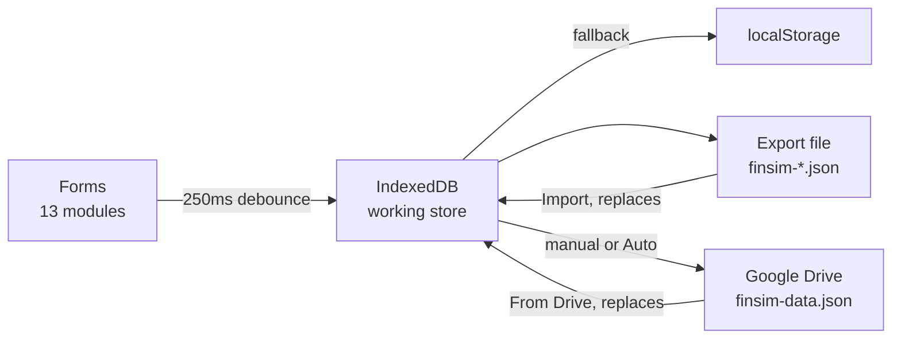

# FinSim — Project Proposal

As of 2026-09-22

## Executive summary

FinSim is a Malaysian personal-finance simulator: thirteen calculators on one page, computed from KWSP, LHDN and PERKESO rules rather than generic overseas formulas. A working build is already live at [kaonhew02.github.io/FinSim](https://kaonhew02.github.io/FinSim/).

This proposal asks for approval to take FinSim from a finished prototype to a maintained product. The four phases in the delivery plan cover an annual statutory-rules refresh, a test suite committed to the repository, offline install, and a second wave of modules.

| At a glance | Detail |
| --- | --- |
| Status | Prototype complete and deployed — 22 commits, 2026-08-17 to 2026-08-24 |
| Live | [kaonhew02.github.io/FinSim](https://kaonhew02.github.io/FinSim/) |
| Repository | [KaonHew02/FinSim](https://github.com/KaonHew02/FinSim) |
| Codebase | 10,749 lines across 7 source files |
| Modules | 13 calculators in 4 groups |
| Stack | Plain HTML, CSS and JavaScript — no framework, no build step, no dependencies |
| Backend | None. Records live in the browser's IndexedDB |
| Hosting cost | GitHub Pages — RM 0 per month |
| The ask | Approval for Phases 1–4, and a decision on each open question at the end |

## Background and the problem

A Malaysian working out their own money has to use tools that get Malaysian rules wrong. The arithmetic in a generic calculator is correct; the statutory basis underneath it is not.

| What a generic calculator does | What Malaysian rules actually say |
| --- | --- |
| EPF as a flat 11% of salary | Third Schedule — wage rounded to the top of its RM 20 band, contribution rounded up to the ringgit |
| No SOCSO or EIS, or a flat percentage | PERKESO contribution tables with a RM 6,000 wage ceiling |
| Monthly tax as annual tax ÷ 12 | LHDN's annualised MTD method, with a bonus taxed separately as additional remuneration |
| Car loan interest on a reducing balance | Hire purchase is flat under the Hire-Purchase Act 1967 — the effective rate is roughly double the quoted one |
| Early settlement as the outstanding balance | Rule of 78 rebate — half way through a 7-year loan it returns barely a quarter of the charges |
| Property purchase priced at the asking price | MOT stamp duty tiers, 0.5% loan-agreement duty, the solicitors' remuneration scale, 8% SST |
| One EPF account | Akaun 1 / 2 / 3 at 75 / 15 / 10 since the May 2024 restructure |

Three further gaps sit on top of that.

1. **The tools are siloed.** A payslip calculator will not hand its net figure to a DSR calculator, so the number a bank divides by has to be re-derived by hand.
2. **Most want an account.** Salary, debts and net worth are the most sensitive figures a person has, and a sign-up form puts them on someone else's server.
3. **Assumptions are hidden.** A projection stated to the sen, with no note on what it assumed, reads as a prediction rather than a direction.

## The proposed solution

One page, thirteen calculators, one shared calculation library. Open it and it runs — no install, no sign-up, and no figure leaves the machine unless the reader presses a button.

The modules are not thirteen separate tools bolted together. The DSR calculator runs gross salary through the PCB module's own statutory stack (`epfContribution`, `socsoContribution`, `eisContribution`, `calculatePcbTax`) to reach the net figure a bank divides by. The retirement calculator runs the compound-interest engine forward to the retirement date, then the drawdown engine from there. Sharing the library is what makes the answers agree with each other.

### Product principles

| Principle | What it means in the build |
| --- | --- |
| No calculate button | Every field is bound to one `renderAll()`; all thirteen modules recompute on every keystroke, so no figure on screen can be stale |
| Malaysian rules first | Statutory tables, not percentages. Payroll figures are calibrated against payroll.my for YA 2026 to the sen |
| Nothing leaves by default | The working store is the reader's own browser. The file and the Drive copy are opt-in, and Auto starts off |
| Say the assumptions out loud | Every module carries a note on what it assumes and where it stops being reliable |
| Reversible, never surprising | Import and From Drive replace rather than merge, state what is in both copies, and wait for agreement |
| No framework, no build step | Plain HTML, CSS and JavaScript. A double-clicked `index.html` is a working app |

## Scope A — the calculator catalogue

Thirteen modules in four sidebar groups. Every one takes the same shape: a sticky input panel on the left, three result tiles and a distribution bar on the right, then tables that flip between yearly and monthly.

| # | Module | Group | Answers | Headline output |
| --- | --- | --- | --- | --- |
| 1 | PCB Calculator | Tax | What lands in my account this month? | Net pay, every statutory deduction, and what the employer adds on top |
| 2 | Income Tax Calculator | Tax | What do I owe for the year? | Tax band by band, ~20 relief lines with their caps, effective vs marginal rate |
| 3 | Home Loan | Loans | What does the bank want every month? | Instalment, total interest, what extra payments save in ringgit and in years, full amortisation |
| 4 | Car Loan | Loans | Hire purchase is quoted flat — what does it really cost? | The effective reducing rate, and early-settlement cost after the Rule of 78 |
| 5 | Personal Loan | Loans | Flat or reducing, on the same rate? | Both instalments side by side, the true rate behind a flat quote, stamp duty and fees |
| 6 | DSR Calculator | Loans | How much more will a bank lend me? | DSR and its band, the monthly room left, and what that room could borrow |
| 7 | Savings Goal | Savings | What must I set aside to have it by then? | The monthly deposit, and what a smaller one costs in time |
| 8 | EPF Calculator | Savings | What does my EPF grow into? | Akaun 1/2/3 split, and a year-by-year projection with a dividend rate set per year |
| 9 | Compound Interest | Savings | What does regular investing turn into? | Final value, contribution, profit, and the month profit overtakes contributions |
| 10 | Retirement Calculator | Savings | Am I on course for the life I want after work? | Fund needed, fund on track for, the gap, and three ways to close it |
| 11 | Net Worth | Planning | Where do I actually stand? | Assets minus liabilities across 19 lines, and a debt-to-asset verdict |
| 12 | Emergency Fund | Planning | How much should be standing by? | A target from real essential spending, plus a recommended cover for that household |
| 13 | Rent vs Buy | Planning | Which leaves me better off? | The winner and by how much, and the year buying pulls ahead |

### The shared calculation library

The top ~1,000 lines of `app.js` are pure functions with no DOM access. Five families:

- **Statutory** — `epfContribution` (Third Schedule bands), `socsoContribution` (PERKESO Category 1 closed form, RM 6,000 ceiling), `eisContribution`, `taxBands`, `calculateLhdnAnnualTax` (with the RM 400 rebate at RM 35,000 chargeable), `calculatePcbTax` (annualised MTD), `epfProjection`.
- **Loans** — `loanInstalment`, `loanSchedule` (extra monthly payment and a one-off lump sum), `hirePurchase`, `effectiveRate` (80-step bisection, since no closed form exists), `ruleOf78Rebate`, `maxLoanReducing`, `maxLoanFlat`.
- **Saving and growing** — `savingsSchedule`, `goalDeposit` (solved in one step, rounded up to the sen), `monthsToGoal`, `compoundSchedule` (interest accrues monthly, credits only when the rest closes).
- **Spending down** — `drawdownFund` (present value of a growing annuity), `drawdownIncome`, `drawdownSchedule` (a fund that runs dry stops paying rather than going negative).
- **Property** — `bandedFee`, `buyingCosts` (MOT stamp duty tiers, 0.5% loan-agreement duty, solicitors' scale on price and loan, 8% SST, RM 2,000 disbursements), `rentVsBuy`.

Rounding is deliberate throughout: `round2` to the sen, `ceilSen` up where a shortfall would matter, `roundUp5` for the MTD rule, `round5` for SOCSO.

## Scope B — the save, scenario and sync layer

FinSim began as thirteen stateless calculators; the persistence layer was added on 2026-08-20. The working store is always the browser. The file and the Drive copy are second copies, and the app opens and calculates normally if neither ever loads.

| Feature | What it does | Needs setting up |
| --- | --- | --- |
| Autosave | Writes the forms to the browser a quarter-second after typing stops, and restores them — including which calculator was open | No |
| Scenarios | Named copies of one calculator's inputs, as chips under the panel head. A chip lights while the form matches it exactly | No |
| Export / Import | One `finsim-YYYY-MM-DD.json` file, downloaded and read back | No |
| To Drive / From Drive | The same envelope, kept as `finsim-data.json` in a folder in the reader's own Google Drive | Yes — one Google Cloud client ID |
| Auto | Pushes to Drive about a minute after typing stops | Yes — and one manual push first |



### Four decisions worth naming

1. **Snapshots are taken by walking the DOM, not from a field list.** Each `<section class="module">` is scanned for `input[id]`, `select[id]` and `.seg[id]`. That picks up run-time fields — the 20 relief lines, the 19 net worth rows, the assumption boxes — for free, so a new calculator is saved, backed up and scenario-able the day it lands with nothing added to `save.js`. State kept outside the inputs goes in `captureExtras` / `applyExtras`.
2. **Records moved from localStorage to IndexedDB.** A browser caps localStorage at about 5 MB per origin, and `kaonhew02.github.io` is one origin shared with the author's other published apps. IndexedDB on the same origin was offered 3,034 MB. It is mirrored in memory so every existing synchronous read kept its shape.
3. **Import and From Drive replace, never merge.** Merging means guessing which saved scenario is which, and a wrong guess leaves two disagreeing copies of "Plan A". Both state what is in each copy, with dates, and wait for agreement.
4. **Auto never opens a sign-in window.** If the Google session has lapsed the push stands down and the stamp goes stale; a popup nobody asked for gets blocked, and one that is not blocked is worse. It also cannot make the first push itself.

## Technical architecture

Seven source files, no build step, no dependencies, no backend. The only third-party code is an icon font and Google's sign-in library, both loaded from a CDN and both optional to the calculators.

| File | Lines | What lives there |
| --- | --- | --- |
| `index.html` | 3,414 | The sidebar, and one `<section class="module">` per calculator |
| `app.js` | 3,922 | The calculation library, then one `renderX()` per module, then the wiring |
| `style.css` | 1,645 | Design tokens, components, responsive rules last |
| `save.js` | 867 | Autosave, scenarios, export/import, the data panel |
| `drive.js` | 536 | The optional Google Drive copy |
| `store.js` | 321 | The IndexedDB adapter, mirrored in memory, falling back to localStorage |
| `drive-config.js` | 44 | Client ID, folder ID and filename — all safe to publish |

### The render loop

On `DOMContentLoaded` the app binds `input` and `change` on every field inside a `.panel` to a single `renderAll()`, which calls all thirteen `renderX()` functions. Hidden modules write to elements nobody is looking at, and the whole pass is sub-millisecond. The benefit is that there is no such thing as stale state.

### Adding a module

A module is four things: a nav button carrying `data-module`, a `<section class="module">` split into a panel and a results column, a `renderX()`, and entries in `MODULES` and `FORM_DEFAULTS`. Nothing has to be added to `save.js`. Where the panel is a long list of money lines it is generated from an array, the way `buildNetWorthUI()` generates the net worth panel and its defaults from `NET_WORTH_GROUPS`.

### Where the rules live

Every figure that a Budget can move is a named constant, so an annual refresh is an edit in one place rather than a hunt through the maths.

| When this changes | Edit |
| --- | --- |
| Tax brackets or the rebate | `TAX_BRACKETS`, `REBATE_CEILING`, `REBATE_AMOUNT` |
| A relief cap, or a new relief | `RELIEF_GROUPS` — the UI builds itself from it |
| SOCSO categories or the ceiling | `SOCSO_CATEGORIES`, `socsoBaseEmployer` |
| EPF account split | `EPF_ACCOUNTS` |
| DSR caps and bands | `DSR_CAPS`, `DSR_BANDS`, `CARD_MIN_RATE` |
| Stamp duty and legal fee scales | `MOT_STAMP_BANDS`, `LEGAL_FEE_BANDS`, `LOAN_STAMP_RATE`, `LEGAL_SST`, `LEGAL_EXTRAS` |
| Net worth or emergency fund lines | `NET_WORTH_GROUPS`, `EF_ITEMS` |

### The backup envelope

One format, three routes in — a file made by Export can be dropped into the Drive folder by hand, and a file pulled off Drive can be fed to Import.

```json
{
  "format": "finsim.backup",
  "version": 1,
  "app": "FinSim",
  "savedAt": "2026-08-24T09:17:00.000Z",
  "stores": {
    "finsim.inputs.v1": "…",
    "finsim.scenarios.v1": "…"
  }
}
```

A store that is not listed in `BACKUP_STORES` is silently not backed up — the sort of bug nobody notices until it matters, so adding one is a two-line change in `save.js` and `store.js` together.

### Hosting and identity

GitHub Pages serves the static files from `KaonHew02/FinSim`. Drive needs a real origin, so the registered one is `https://kaonhew02.github.io`; a double-clicked `index.html` keeps working for the calculators and for Export/Import, but never for Drive, because `file://` has no origin Google will issue a token to. The OAuth scope is `drive.file`, which grants access only to files the app itself created — it cannot read other documents and cannot list the Drive. That scope is not sensitive, so it needs no verification review from Google.

## Non-functional requirements

| Requirement | Target | Where it stands |
| --- | --- | --- |
| Privacy | No account, no telemetry, no analytics, no third-party request carrying a figure | Met. The only outbound call is to Google Drive, and only when the reader presses a button or turns Auto on |
| Data residency | Figures live in the reader's own browser and, if they choose, their own Drive | Met |
| Offline | Calculators work with the network off | Met on a loaded page. Not yet installable — the icon font is CDN-hosted and there is no service worker (Phase 3) |
| Responsiveness | Every keystroke repaints all 13 modules | Met — the full pass is sub-millisecond |
| Load | Static files only, no build artefact, no framework payload | Met — 10,749 lines of source, served straight |
| Mobile | No horizontal overflow at 375 px | Met and verified. Breakpoints at 1180, 900 and 720 px; the sidebar collapses to an icon rail |
| Accessibility | Keyboard-reachable controls, labelled state, readable contrast | Partial — 33 ARIA attributes in place. A full audit is Phase 2 |
| Browser support | Current Chrome, Edge, Firefox and Safari | Met. IndexedDB degrades to localStorage where it is missing or refuses to open |
| Resilience | The app opens and calculates if the save or Drive layer never loads | Met by design, and the ordering to keep if either is rewritten |
| Failure reporting | A write that does not land must not claim to have saved | Met — failed writes surface in the data panel instead of being swallowed |

### Accuracy standard

The payroll modules are calibrated against payroll.my for YA 2026 to the sen. That is the standard the rest of the app is held to: where a published Malaysian authority states a table, FinSim reproduces the table rather than approximating it with a percentage.

## Out of scope

These are deliberate omissions, not gaps. Each is called out in the panel hints of the module it would affect, because a projection that hides what it left out is worse than one that admits it.

| Not modelled | Why |
| --- | --- |
| RPGT on property sales | 30% of the gain inside three years, tapering to nil from the sixth — it depends on facts the app does not ask for |
| First-home stamp duty exemptions | They move with every Budget and turn on eligibility the app cannot verify |
| Daily-rest loan interest | Housing loans are charged daily; the monthly-rest basis a letter offer quotes moves each month by a few ringgit and leaves totals within rounding |
| Market sequence risk | A long projection is a direction, not a prediction, and a single average return says so more honestly than a false distribution |
| Tax on investment returns | Out of scope for a planning figure stated in today's ringgit |
| Any bank's internal credit scoring | Banks apply their own income haircuts and stress rates; DSR caps in the app are typical ceilings, not rules |
| Simpanan Shariah EPF split | Conventional savings only |
| EPF withdrawal rules and the age-55 lump sum | Not modelled in the retirement projection |

Also out of scope for the product itself: user accounts, a server, a database, multi-currency, non-Malaysian tax regimes, and any feature that would require a figure to leave the reader's control.

### The compliance boundary

FinSim is a planning tool, not financial advice, and every screen and both README files say so. It makes no recommendation about a specific product, institution or security, quotes no bank's rates as fact, and takes no fee or referral. Rate guidance is written as ranges — banks 7–13% flat on a personal loan, public-sector schemes 3.5–5% — rather than as any named lender's offer. For anything binding, the app directs the reader to KWSP, LHDN or the bank itself.

**Open question for review:** whether the disclaimer wording should be reviewed against Securities Commission and Bank Negara guidance on financial advisory before any promotion beyond word of mouth.

## Delivery plan

Phase 0 is done and deployed. Phases 1–4 are what this proposal asks for. The order is deliberate: the rules refresh protects the figures already on screen, and the test suite has to exist before the module count grows again.

### Phase 0 — shipped

| Date | Delivered |
| --- | --- |
| 2026-08-17 | All thirteen calculators, the shared library, the logo and `MODULES.md` |
| 2026-08-20 | Persistence: autosave, named scenarios, Export/Import, the Google Drive copy, the move to IndexedDB, and the Auto switch |
| 2026-08-21 | Mobile layout — icon rail, three breakpoints, no horizontal overflow at 375 px |
| 2026-08-24 | Date-format handling on the backup stamp |

### Phase 1 — statutory rules refresh (proposed)

The single largest risk to a calculator like this is quietly going out of date. Every Budget moves relief caps, and EPF declares a dividend once a year without notice.

- Refresh `TAX_BRACKETS`, `RELIEF_GROUPS`, `SOCSO_CATEGORIES`, `EPF_ACCOUNTS`, `DSR_CAPS` and the stamp duty scales for the current assessment year.
- Stamp each module with the assessment year it computes, visible on screen.
- Write the refresh down as a checklist in the repository, so it is a task rather than a memory.

### Phase 2 — test suite and accessibility (proposed)

The app currently has no tests in the repository. The 23 written during the persistence work ran from a scratch directory and were not committed — this is the clearest gap in the project.

- Commit a jsdom harness that loads `index.html`, evaluates `app.js`, fires real `input` events and reads the result ids back.
- Cover, per module: the closed-form answer, the empty state, a zero-rate case, the extremes, both table views, the presets and Reset.
- Cover the save layer: autosave across reloads, scenario save/load/delete, chip lighting, replace-not-merge on import, and the junk-file refusal.
- Run it in GitHub Actions on every push.
- Complete the accessibility audit: focus order, labels on generated fields, contrast against the ivory palette, and screen-reader wording for the result tiles.

### Phase 3 — offline install (proposed)

- Add a web app manifest and a service worker so FinSim installs to a phone home screen and opens with the network off.
- Self-host the icon font, removing the last CDN dependency from the calculators.
- Keep the no-build-step rule: the service worker is one more plain file.

### Phase 4 — second wave of modules (proposed)

Candidates, in the order they would be built. Each is a nav button, a section, a `renderX()` and two registry entries, and each is saved and backed up the day it lands.

| Candidate | Answers |
| --- | --- |
| Zakat calculator | What is due on savings, income and gold at the current nisab? |
| PTPTN repayment | What does the outstanding balance cost, and what does paying ahead save? |
| Insurance needs | How much cover would actually replace my income? |
| ASB financing | Does a loan to buy units beat paying in cash, at this year's dividend? |
| Credit card payoff | Avalanche against snowball, on the cards I actually hold? |
| Bonus planner | Where does this bonus do the most, after the PCB bite? |

**Open question for review:** whether Phase 4 should be reordered, trimmed, or replaced with modules not on this list.

## Resourcing, cost and timeline

Running cost is the strongest part of the case: there is no server to pay for, and there never will be, because holding a reader's salary figure on a server is the thing the product refuses to do.

| Cost line | Amount | Note |
| --- | --- | --- |
| Hosting | RM 0 / month | GitHub Pages, static files |
| Database | RM 0 / month | None. Records are in the reader's own browser |
| Google Cloud | RM 0 / month | `drive.file` is not a sensitive scope, so no verification review and no quota cost at this scale |
| Third-party services | RM 0 / month | No analytics, no error reporting, no CDN account |
| Domain | RM 0, or ~RM 60 / year | Optional. Only if a custom domain replaces the `github.io` address |
| **Total** | **RM 0–60 / year** | |

### Effort

These are estimates for one part-time developer, and are the figures most worth challenging in review — Phase 0 took eight days at that pace, which is the only real data point.

| Phase | Estimate | Depends on |
| --- | --- | --- |
| 1 — Statutory rules refresh | 3–4 days | The current year's Budget being published |
| 2 — Test suite and accessibility | 6–8 days | Nothing |
| 3 — Offline install | 2–3 days | Nothing |
| 4 — Second wave of modules | 2–3 days per module | Phase 2 landing first |
| Annual upkeep, thereafter | 3–4 days / year | Recurs every Budget |

Phases 1 to 3 are about three weeks of part-time work in total. Phase 4 is open-ended by design and can stop after any module.

### Assumptions behind these figures

- One developer, part-time, continuing at the pace of Phase 0.
- No paid design, marketing or support function.
- No custom domain unless the project decides it wants one.
- Google Drive stays free at this usage; the app writes one JSON file per reader.

## Risks and mitigations

The two that matter most are the first two: a calculator that is quietly wrong is worse than no calculator, and a reader who loses their figures does not come back.

| Risk | Impact | Likelihood | Mitigation |
| --- | --- | --- | --- |
| Statutory rules go stale after a Budget | High — every payroll figure becomes wrong without warning | High, annually | Phase 1: every movable figure is already a named constant in one place. Stamp the assessment year on screen and keep a refresh checklist in the repository |
| A regression ships unnoticed | High — there are no committed tests today | Medium | Phase 2: commit the jsdom harness and run it in CI on every push |
| Reader clears browsing data and loses everything | High for that reader | Medium | Already mitigated three ways: Export to a file, the Drive copy, and a prompt on an empty browser offering to bring the Drive copy down |
| A new store is added and silently not backed up | Medium — invisible until a restore | Low | `BACKUP_STORES` is documented as the single list to update; make it a line in the add-a-module checklist |
| Google changes the sign-in library or the OAuth flow | Medium — Drive stops working | Low | The app is designed to open and calculate without `drive.js`. Export/Import needs no account and is the documented fallback |
| The CDN icon font fails or is blocked | Low — icons vanish, figures do not | Medium | Phase 3 self-hosts the font |
| A reader shares the Drive folder publicly | High — exposes salary and every saved scenario | Low | `docs/DRIVE.md` opens by telling the reader to keep the folder Restricted; the scope is `drive.file`, so the app itself can see nothing else |
| A reader treats a 30-year projection as a prediction | Medium | Medium | Every module states its assumptions on screen, and both READMEs say the app is a planning tool, not advice |
| Single-maintainer dependency | Medium — the project stops if one person stops | Medium | `MODULES.md` documents every formula, assumption, convention and the add-a-module recipe; the stack has no framework a successor would have to learn |
| A browser drops or restricts IndexedDB | Low | Low | `store.js` falls back to localStorage and the app is exactly what it was |

## Success metrics and acceptance criteria

FinSim collects no analytics and this proposal does not ask to change that. So the metrics are properties of the build, checkable by running it — not usage figures, which the product is deliberately unable to measure.

### Acceptance criteria per phase

| Phase | Done when |
| --- | --- |
| 1 | Every statutory constant matches the current assessment year; each module shows the year it computes; the refresh checklist is committed |
| 2 | The jsdom suite is committed, covers all 13 modules and the save layer, passes in GitHub Actions on every push, and the accessibility audit has no outstanding high findings |
| 3 | FinSim installs to a phone home screen, opens and calculates with the network off, and loads no file from a CDN for the calculators to work |
| 4 | Each new module ships with tests, an entry in `MODULES.md`, and an assumptions note on screen — and is saved, backed up and scenario-able without a line added to `save.js` |

### Standing quality bar

- Payroll figures agree with payroll.my to the sen for the current assessment year.
- A full `renderAll()` pass stays under a millisecond.
- No horizontal overflow at 375 px on any module.
- The app opens and calculates with `save.js`, `store.js` and `drive.js` all absent.
- A failed write never reports itself as saved.
- Every module's assumptions note names what it does not model.

### If usage ever needs measuring

The honest options are ones that hold no figures: a GitHub star or fork count, unsolicited reports, and Google Cloud's own count of accounts that have granted the Drive scope. Anything finer would mean sending something from the reader's browser, which is the trade the product exists to refuse.

## Next steps and approvals

Four decisions unblock the work. Phase 2 needs no decision at all and can start immediately, since the test gap exists whatever else is agreed.

- [ ] Approve Phases 1–3 — about three weeks part-time, RM 0 in new cost
- [ ] Confirm the assessment year Phase 1 refreshes to, and who supplies the Budget figures
- [ ] Decide whether Phase 4 is approved as a block, module by module, or deferred
- [ ] Decide whether the disclaimer wording goes for a compliance read before any promotion
- [ ] Decide on a custom domain, or keep the `github.io` address

### Open questions

| Question | Why it matters | Needed by |
| --- | --- | --- |
| Who owns the annual rules refresh? | It recurs every Budget and is the top risk in the register. Without a named owner it becomes a memory | Before Phase 1 |
| Is the effort estimate realistic? | Phase 0's eight days is the only data point behind every figure in the estimate table | Before approval |
| Should Phase 4 modules be reordered? | The six candidates are a judgement call, not a researched demand | Before Phase 4 |
| Does the project want to be findable? | Nothing in the build markets it, and the no-analytics stance means success would be invisible | Any time |

### What happens on approval

1. Commit the jsdom harness and wire it into GitHub Actions — Phase 2 starts, no decisions required.
2. Refresh the statutory constants once the assessment year is confirmed.
3. Add the manifest and service worker, and self-host the icon font.
4. Build Phase 4 modules one at a time, each with tests and a `MODULES.md` entry, stopping whenever the list stops being worth it.
