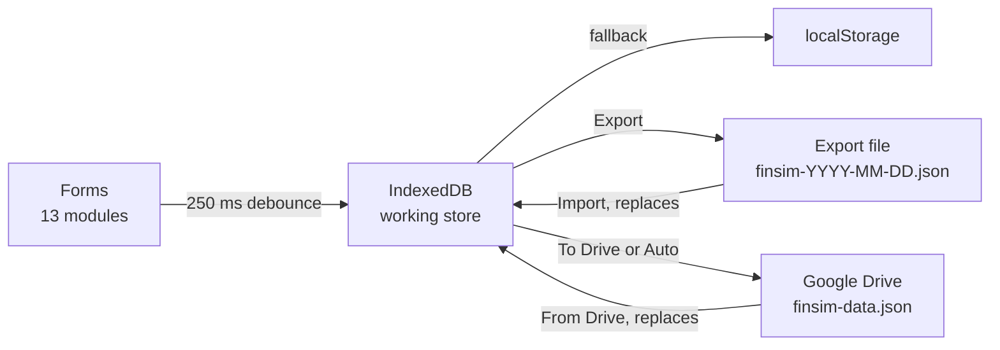

# FinSim — Project Proposal

Version 2.0 · 23 September 2026 · Prepared by Kaon Hew

> The same proposal is in the repository as a Word document with a cover page, contents and a sign-off page: `FinSim-Project-Proposal.docx`.

| Document control | Detail |
| --- | --- |
| Document | Project proposal |
| Project | FinSim — Malaysia Money Calculators |
| Version | 2.0 — supersedes the draft of 22 September 2026 |
| Date | 23 September 2026 |
| Prepared by | Kaon Hew |
| Repository | [github.com/KaonHew02/FinSim](https://github.com/KaonHew02/FinSim) |
| Live site | [kaonhew02.github.io/FinSim](https://kaonhew02.github.io/FinSim/) |
| Status | For review and approval |

### Version history

| Version | Date | Change |
| --- | --- | --- |
| 1.0 | 22 Sep 2026 | First draft — scope, architecture, delivery phases, risks and costs, written up from the build as it stood. |
| 2.0 | 23 Sep 2026 | Brought up to date with the security hardening of 22 September (Content-Security-Policy, import validation, licence, optional build). Adds objectives, intended users, a specification for every module, security and privacy, build and deployment, the statutory parameters, a glossary, the commit history and a sign-off page. |

## 1. Executive summary

FinSim is a Malaysian personal-finance simulator: thirteen calculators on one web page, computed from KWSP (EPF), LHDN and PERKESO rules rather than generic overseas formulas. A working build is already live at [kaonhew02.github.io/FinSim](https://kaonhew02.github.io/FinSim/), with no account, no server and no running cost.

This proposal asks for approval to take FinSim from a finished prototype to a maintained product over four phases: an annual statutory-rules refresh, a committed test suite with an accessibility audit, offline install, and a second wave of modules. Phases 1 to 3 are about three weeks of part-time work and add no running cost.

Since the first draft on 22 September 2026, the project has closed its most serious defect: a stored cross-site-scripting (XSS) hole in the scenario chips. It has also added a Content-Security-Policy, validation of every imported file, a licence and an optional minifying build. Those changes are reflected throughout this version.

| At a glance | Detail |
| --- | --- |
| Status | Prototype complete and deployed — 24 commits, 17 August to 22 September 2026 |
| Live | [kaonhew02.github.io/FinSim](https://kaonhew02.github.io/FinSim/) |
| Repository | [KaonHew02/FinSim](https://github.com/KaonHew02/FinSim) (public) |
| Codebase | 11,057 lines across 7 runtime files, plus a 164-line optional build script |
| Documentation | `README.md`, `MODULES.md` (every formula and assumption), `BUILD.md`, `docs/DRIVE.md`, `LICENSE` |
| Modules | 13 calculators in 4 groups — Tax, Loans, Savings, Financial Planning |
| Stack | Plain HTML, CSS and JavaScript. No framework, no runtime dependencies, and a build step that is optional |
| Backend | None. Records live in the reader's own browser (IndexedDB) |
| Running cost | RM 0 per month on GitHub Pages |
| Biggest gap | No automated tests in the repository |
| The ask | Approve Phases 1–3, decide on Phase 4, and settle the decisions in Section 17 |

## 2. Background and problem statement

Malaysians working out their own money mostly have to use tools that get Malaysian rules wrong. The arithmetic in a generic calculator is right, but the statutory rules it is built on are not.

| What a generic calculator does | What Malaysian rules actually say |
| --- | --- |
| EPF as a flat 11% of salary | Third Schedule — the wage is taken to the top of its RM 20 band and the contribution rounded up to the ringgit |
| No SOCSO or EIS, or a flat percentage | PERKESO contribution tables, with a RM 6,000 wage ceiling |
| Monthly tax as annual tax ÷ 12 | LHDN's annualised MTD method, with a bonus taxed separately as additional remuneration |
| Car loan interest on a reducing balance | Hire purchase is flat-rate under the Hire-Purchase Act 1967, so the effective rate is roughly double the quoted one |
| Early settlement as the outstanding balance | Rule of 78 rebate. Halfway through a 7-year loan it returns barely a quarter of the charges |
| A property priced at the asking price | MOT stamp duty tiers, 0.5% loan-agreement duty, the solicitors' remuneration scale, 8% SST and disbursements |
| One EPF account | Akaun 1 / 2 / 3 at 75 / 15 / 10 since the May 2024 restructure |

Three further problems add to that.

1. **The tools don't talk to each other.** A payslip calculator will not hand its net figure to a DSR calculator, so the number a bank divides by has to be worked out again by hand.
2. **Most want an account.** Salary, debts and net worth are among the most sensitive figures a person has, and signing up puts them on someone else's server.
3. **Assumptions are hidden.** A projection shown to the sen, with no note on what it assumed, reads like a prediction when it is only a direction.

## 3. Objectives

Each objective is something that can be checked by running the app, not a usage target. The product deliberately collects no usage data (Section 16).

| # | Objective | Measured by |
| --- | --- | --- |
| O1 | **Accuracy.** Reproduce the published Malaysian tables rather than approximate them | Payroll figures agree with payroll.my to the sen for the current assessment year |
| O2 | **Privacy.** No account, no telemetry, no figure leaving the browser by default | The only outbound request is to Google Drive, and only after a button press or with Auto switched on |
| O3 | **Coherence.** One calculation library shared by every module | The net pay in the PCB calculator is the net pay the DSR calculator divides by |
| O4 | **Transparency.** Assumptions stated on screen | Every module carries a note naming what it assumes and what it does not model |
| O5 | **Durability.** Figures survive a reload, a cleared browser and a second device | Autosave, Export/Import and the Drive copy all round-trip without loss |
| O6 | **Maintainability.** A Budget refresh is an edit in one place, protected by tests | Every movable figure is a named constant, and CI runs the suite on every push (Phase 2) |
| O7 | **Zero running cost.** | Static hosting only — no server, database or paid service |

## 4. Intended users and use cases

FinSim is written for someone in Malaysia working out their own money, not for advisers or institutions. The modules were designed around these situations:

| Situation | What the reader wants to know | Modules |
| --- | --- | --- |
| Starting a job, or a change in salary | What lands in my account, and what my employer pays on top | PCB, EPF |
| Filing the annual return (BE form) | What I owe, and which reliefs are worth claiming | Income Tax |
| Buying a first home | The instalment, the entry costs, whether the bank will lend, and whether buying beats renting | Home Loan, DSR, Rent vs Buy |
| Buying a car | What a flat hire-purchase rate really costs, and what settling early saves | Car Loan |
| Borrowing for something else | Flat against reducing, and how much more a bank will lend | Personal Loan, DSR |
| Saving towards a date | The monthly deposit that gets there on time | Savings Goal, Compound Interest |
| Planning retirement | Whether current savings reach the life I want after work | Retirement, EPF, Compound Interest |
| Taking stock | Where I stand, and whether my emergency cushion is big enough | Net Worth, Emergency Fund |

> These are the situations the modules were designed around, not findings from user research. No research has been done, and the product collects no usage data by design.

## 5. The proposed solution

One page, thirteen calculators, one shared calculation library. Open it and it runs — no install, no sign-up, and no figure leaves the machine unless the reader presses a button.

The modules are not thirteen separate tools bolted together. The DSR calculator runs gross salary through the PCB module's own statutory functions (`epfContribution`, `socsoContribution`, `eisContribution`, `calculatePcbTax`) to reach the net figure a bank divides by. The retirement calculator runs the compound-interest engine forward to the retirement date, then the drawdown engine from there. Because the modules share one library, their answers agree with each other.

### 5.1 Product principles

| Principle | What it means in the build |
| --- | --- |
| No calculate button | Every field is bound to one `renderAll()`. All thirteen modules recalculate on every keystroke, so no figure on screen can be out of date |
| Malaysian rules first | Statutory tables, not percentages. Payroll figures are calibrated against payroll.my for YA 2026 to the sen |
| Nothing leaves by default | The working store is the reader's own browser. The file and the Drive copy are opt-in, and Auto starts off |
| State the assumptions | Every module carries a note on what it assumes and where it stops being reliable |
| No surprises, and reversible | Import and From Drive replace rather than merge, say what is in both copies, and wait for the reader to agree |
| No framework, no required build | Plain HTML, CSS and JavaScript. A double-clicked `index.html` is a working app; `build.js` is optional |
| Secure by construction | Anything that came from storage or a file is built into the page as text, never as HTML, and a strict Content-Security-Policy backs that up |

### 5.2 The reader's experience

Every calculator is laid out the same way, so a reader who can use one can use all thirteen.

- **A sticky input panel** on the left, and a results column on the right.
- **Three result tiles.** The dark one is the headline figure, and the two beside it explain it.
- **A distribution bar** showing what the total is made of. Where two bars appear (net worth, retirement, rent vs buy) they share one scale, so the gap between them is the point.
- **Tables** that switch between yearly and monthly views.
- **Blue assumption notes** stating what the module assumes and where it stops being reliable.
- **Pill shortcuts** under a field, which fill that field rather than acting as separate inputs, and light up again when a typed value matches.
- **Reset** on every panel, which restores that calculator's defaults and leaves the others alone.
- **An empty state.** While the essential input is blank, the module shows a prompt instead of a wall of RM 0.00.
- **One date format, DD-MM-YYYY, on every machine.** Dates are written out by the app rather than left to the browser's locale. A date that does not exist, such as 31-02-2026, is refused rather than quietly moved into March.
- **A collapsible sidebar** that folds to an icon rail, with breakpoints at 1,180, 900 and 720 px and no horizontal overflow at 375 px.

## 6. Scope A — the calculator catalogue

Thirteen modules in four sidebar groups.

| # | Module | Group | Answers | Headline output |
| --- | --- | --- | --- | --- |
| 1 | PCB Calculator | Tax | What lands in my account this month? | Net pay, every statutory deduction, and what the employer adds on top |
| 2 | Income Tax | Tax | What do I owe for the year? | Tax band by band, 23 relief lines with their caps, effective vs marginal rate |
| 3 | Home Loan | Loans | What does the bank want every month? | Instalment, total interest, what extra payments save in ringgit and in years |
| 4 | Car Loan | Loans | What does a flat hire-purchase rate really cost? | The effective reducing rate, and early-settlement cost after the Rule of 78 |
| 5 | Personal Loan | Loans | Flat or reducing, on the same rate? | Both instalments side by side, the true rate behind a flat quote, stamp duty and fees |
| 6 | DSR Calculator | Loans | How much more will a bank lend me? | DSR and its band, the monthly room left, and what that room could borrow |
| 7 | Savings Goal | Savings | What must I set aside to have it by then? | The monthly deposit, and what a smaller one costs in time |
| 8 | EPF Calculator | Savings | What does my EPF grow into? | Akaun 1/2/3 split, and a yearly projection with a dividend set per year |
| 9 | Compound Interest | Savings | What does regular investing turn into? | Final value, contributions, profit, and the month profit overtakes contributions |
| 10 | Retirement | Savings | Am I on course for the life I want after work? | Fund needed, fund on track for, the gap, and three ways to close it |
| 11 | Net Worth | Planning | Where do I actually stand? | Assets minus liabilities across 19 lines, and a debt-to-asset verdict |
| 12 | Emergency Fund | Planning | How much should be standing by? | A target from essential spending, plus a recommended cover for that household |
| 13 | Rent vs Buy | Planning | Which leaves me better off? | The winner and by how much, and the year buying pulls ahead |

### 6.1 Module specifications

What each module takes, what it gives back, how it works, and where it stops being reliable. `MODULES.md` in the repository goes into more depth.

#### Module 1 — PCB Calculator

| Item | Detail |
| --- | --- |
| Answers | What will actually land in my account this month? |
| You enter | Basic salary; bonus or allowances this month; employee EPF rate (11 / 9 / 8%); employer EPF rate (13 / 12%); SOCSO category. |
| You get | Net pay; every statutory deduction line by line; what the employee pays and what the employer adds on top; a bar showing where the gross went. |
| How it works | EPF is charged on salary and bonus; SOCSO and EIS on salary only, both capped at a RM 6,000 wage. PCB uses LHDN's annualised method: annualise the salary, subtract the RM 9,000 individual relief and EPF relief (capped at RM 4,000), tax it through the brackets, divide by 12 and round up to 5 sen. A bonus is additional remuneration: tax the year including the bonus, subtract twelve regular MTDs, and deduct the difference in the month it is paid. |
| Assumptions | Resident individual, YA 2026 brackets. Only the individual and EPF reliefs apply to PCB, matching payroll.my. Calibrated against payroll.my to the sen. |

#### Module 2 — Income Tax Calculator

| Item | Detail |
| --- | --- |
| Answers | What do I owe for the year, and which relief is actually worth claiming? |
| You enter | Annual income, then any of the 23 LHDN relief lines in four groups, each with its own cap (Appendix A.2). |
| You get | Chargeable income; tax band by band; the RM 400 rebate if it applies; effective vs marginal rate; what each relief line actually contributed after its cap. |
| How it works | Each cap is enforced on its own, so claiming above a cap wastes the excess rather than spilling into another line. Relief types are `fixed`, `flag`, `count` (per child) and `amount` (capped spend). The rebate applies at chargeable income of RM 35,000 or less. |
| Assumptions | Resident individual. Caps move with every Budget, so `RELIEF_GROUPS` is the single place to update them, and the panel builds itself from it. |

#### Module 3 — Home Loan

| Item | Detail |
| --- | --- |
| Answers | What does the bank ask for every month, and how much of it never touches the loan? |
| You enter | Property price; deposit (ringgit or percent); rate; tenure; optionally an extra monthly payment and a one-off lump sum in a chosen year. |
| You get | Instalment; total interest; total paid; what the extra payments save in ringgit and in years; the full amortisation schedule, yearly or monthly. |
| How it works | `loanInstalment()` gives the payment: P·i·(1+i)ⁿ / ((1+i)ⁿ − 1). `loanSchedule()` applies extra payments to principal each month, so the schedule ends early and the saving is the difference between the two totals. |
| Assumptions | Monthly rest, the basis a letter offer is quoted on. Housing loans are actually charged daily, which moves each month by a few ringgit but leaves the totals within rounding. Margin of finance capped at 90%, tenure at 50 years. |

#### Module 4 — Car Loan

| Item | Detail |
| --- | --- |
| Answers | Hire purchase is quoted flat. What does that instalment really cost? |
| You enter | Car price; deposit; flat rate; tenure; a settlement point. |
| You get | Instalment; term charges; the effective reducing rate (roughly double the flat rate); what settling early costs after the Rule of 78 rebate; the payment schedule. |
| How it works | Interest = principal × flat rate × years, charged on the whole original amount for the whole term. `effectiveRate()` finds the reducing-balance rate that would demand the same instalment by bisecting 80 times, since there is no closed form. The rebate is charges × n(n+1) / N(N+1), where n is the number of months left. |
| Assumptions | Fixed-rate hire purchase under the Hire-Purchase Act 1967. Tenure capped at 9 years, margin at 90%. |

#### Module 5 — Personal Loan

| Item | Detail |
| --- | --- |
| Answers | An unsecured loan quoted flat: what is the instalment, and what does the rate really mean? |
| You enter | Amount; tenure (years or months); rate; a Flat / Reducing toggle; processing fees; a settlement month. |
| You get | The instalment on both bases side by side; the effective rate behind a flat quote; total cost including 0.5% loan-agreement stamp duty and fees; early-settlement figures; the schedule. |
| How it works | Flat reuses the hire-purchase maths and reducing uses the ordinary loan maths. The comparison runs both on the same rate so the gap is visible. The default is Flat, because that is how Malaysian banks quote. |
| Assumptions | Tenure capped at 10 years. Rate guidance is given as ranges (banks 7–13% flat, public-sector schemes 3.5–5%), never as any named lender's rate. |

#### Module 6 — DSR Calculator

| Item | Detail |
| --- | --- |
| Answers | How much more will a bank actually lend me? |
| You enter | Income (gross or net); fixed allowances; variable income and the share of it to count; employment type; the DSR cap to test; every existing commitment — home, car, personal, PTPTN, credit-card balance, other. |
| You get | Net income the way a bank computes it; DSR and its band; net disposable income with a verdict; the monthly room left before the cap; what that room could borrow as a home, car or personal loan. |
| How it works | Gross income is run through the PCB module's own statutory functions (EPF at 11%, SOCSO, EIS, PCB). Variable income is discounted (80% by default). A credit card counts at 5% of its balance. DSR = commitments ÷ net income. Room = net × cap − commitments, turned into a loan amount by `maxLoanReducing()` or `maxLoanFlat()`. |
| Assumptions | Caps (private 60%, GLC 70%, government 80%) are typical ceilings, not rules. Banks apply their own income haircuts and stress rates, which are not modelled. |

#### Module 7 — Savings Goal

| Item | Detail |
| --- | --- |
| Answers | What does it take every month to have the money by the time I need it? |
| You enter | Target; amount already saved; a deadline in months or as a date (either fills the other); expected return; optionally what I can actually spare. |
| You get | The monthly deposit needed; where the final balance came from (head start, deposits, growth); if the deposit is smaller, how much later I arrive and how far short I am on the deadline. |
| How it works | `goalDeposit()` solves the annuity in one step and rounds up to the sen, so a goal is never missed by rounding. `savingsSchedule()` trims the final deposit to hit the target exactly. `monthsToGoal()` handles a smaller deposit. |
| Assumptions | Deposits land at month end, as a standing instruction does. The default return is 0% on purpose: for a fixed date, growth should be a bonus, not the plan. |

#### Module 8 — EPF Calculator

| Item | Detail |
| --- | --- |
| Answers | What goes in each month, and what does it grow into by the time I can touch it? |
| You enter | Salary; employee and employer rates; voluntary top-up; current balance; age; the age to project to (default 55); annual salary growth; a dividend rate, which can be overridden year by year. |
| You get | Monthly and yearly contributions; the Akaun 1 / 2 / 3 split (75 / 15 / 10); a year-by-year projection. |
| How it works | `epfProjection()` credits the dividend once a year. The opening balance earns for twelve months, and each contribution only for the months after it lands, which averages 5.5/12 of a year across twelve equal contributions. Salary rises at each year end. |
| Assumptions | EPF declares its rate each year without notice, so the table takes one rate per year. Conventional savings only — no Simpanan Shariah split. |

#### Module 9 — Compound Interest

| Item | Detail |
| --- | --- |
| Answers | What does regular investing turn into, and how much of that is mine versus the market's? |
| You enter | Initial investment; monthly contribution; expected return; period; how often interest is credited (monthly, quarterly, yearly); inflation. |
| You get | Final value; total contributed; profit; the month profit overtakes contributions; the balance in today's money; a lever table (RM 100 more a month, 1% better return, 5 more years, starting later); the yearly run. |
| How it works | `compoundSchedule()` accrues interest monthly but only credits it when the rest closes, so money waiting for the credit date does not compound. This is how EPF and ASB weight a dividend. At monthly rests it matches the textbook annuity formula to the sen. |
| Assumptions | Contributions at month end. At yearly rests this reads slightly higher than calculators that give within-year contributions no interest; the month-weighted Malaysian treatment is the more accurate one. |

#### Module 10 — Retirement Calculator

| Item | Detail |
| --- | --- |
| Answers | What does the life I want after work cost, and am I on course for it? |
| You enter | Monthly income wanted in today's ringgit; other income then (pension, rental); age now and at retirement; how long the money must last; savings so far; monthly contribution; a return while working and a lower one after; inflation. |
| You get | The fund needed on the day I retire; what I am on track for; the gap; how far my current path pays (for example "until age 74, 10 years short"); three ways to close it — save more, work longer, or want less. |
| How it works | Accumulation with `compoundSchedule()`; the target from `drawdownFund()`, the present value of an inflation-rising withdrawal; the gap closed by `goalDeposit()`, a break-even age search in both directions, and `drawdownIncome()` deflated back to today. |
| Assumptions | The post-retirement return is deliberately lower. Withdrawals rise with inflation monthly. Market sequence risk, EPF withdrawal rules and a lump sum at 55 are not modelled. |

#### Module 11 — Net Worth

| Item | Detail |
| --- | --- |
| Answers | Where do I actually stand? |
| You enter | 19 lines in five groups — cash and bank, investments, property and vehicles against long-term and short-term debt — following AKPK's grouping. Optionally monthly spending, income and age. |
| You get | Net worth; assets; liabilities; each line's share of its side; money reachable this week and how many months it covers; what is locked in EPF; debt-to-asset verdict; a par figure for age and income; every line sorted biggest first. |
| How it works | The panel and its defaults are generated from `NET_WORTH_GROUPS` by `buildNetWorthUI()`. The asset and debt bars share one scale. The par figure is the rule of thumb age × annual income ÷ 10. |
| Assumptions | Assets at what they would sell for today, debts at what they would cost to settle today. EPF counts in net worth but not in money reachable this week. |

#### Module 12 — Emergency Fund

| Item | Detail |
| --- | --- |
| Answers | How much should be standing by before a bad month turns into a bad year? |
| You enter | Eight lines of essential monthly spending; months of cover wanted; three questions about the household; amount already set aside; monthly saving; what it earns. |
| You get | The fund needed; what is still to find; months covered now; when I get there; what it takes to finish inside a year; a recommended cover with the reasons spelled out. |
| How it works | Target = essential spending × months. Reuses `monthsToGoal()`, `goalDeposit()` and `savingsSchedule()`. The recommendation comes from `suggestedCover()` (Appendix A.8). |
| Assumptions | Essential means what cannot stop being paid, not current spending. Money is assumed to be reachable the same day, which is why the default return is only 2.5%. |

#### Module 13 — Rent vs Buy

| Item | Detail |
| --- | --- |
| Answers | Over the years I would actually stay, which one leaves me better off? |
| You enter | Rent and how fast it rises; price; deposit; loan rate and term; years of stay; property growth; upkeep; selling costs; the return on cash not sunk into a house. |
| You get | The winner and by how much; what each path leaves; the year buying pulls ahead; a full cost breakdown of both sides; a year-by-year table. |
| How it works | `rentVsBuy()` runs monthly and holds both sides to the same standard. The buyer's worth is value − outstanding loan − selling costs. The renter starts with the deposit and entry fees, and invests the difference between the buyer's outlay and the rent each month (or draws it down if rent is higher). Entry costs come from `buyingCosts()` (Appendix A.6). |
| Assumptions | RPGT and first-home stamp duty exemptions are not modelled, and both are called out on screen. The renter is assumed to actually invest the difference. |

### 6.2 The shared calculation library

The first ~1,000 lines of `app.js` are pure functions with no DOM access. They fall into five groups:

| Family | Functions | Notes |
| --- | --- | --- |
| Statutory | `epfContribution`, `socsoContribution`, `eisContribution`, `taxBands`, `calculateLhdnAnnualTax`, `calculatePcbTax`, `epfProjection` | Third Schedule bands; PERKESO closed form reproducing the published table; annualised MTD |
| Loans | `loanInstalment`, `loanSchedule`, `hirePurchase`, `hirePurchaseSchedule`, `effectiveRate`, `ruleOf78Rebate`, `maxLoanReducing`, `maxLoanFlat`, `loanYearRows` | Monthly rest; flat-rate hire purchase; 80-step bisection for the effective rate |
| Saving and growing | `savingsSchedule`, `goalDeposit`, `monthsToGoal`, `compoundSchedule`, `goalYearRows` | Deposits at month end; interest accrues monthly and is credited when the rest closes |
| Spending down | `drawdownFund`, `drawdownIncome`, `drawdownSchedule` | Growing annuity; a fund that runs dry stops paying rather than going negative |
| Property | `bandedFee`, `buyingCosts`, `rentVsBuy` | MOT tiers, loan-agreement duty, solicitors' scale, SST, disbursements |

Rounding is deliberate throughout: `round2` to the sen, `ceilSen` up where a shortfall would matter, `roundUp5` up to 5 sen for the MTD rule, and `round5` to the nearest 5 sen for SOCSO.

### 6.3 Rules every module follows

| Rule | Why |
| --- | --- |
| Money in and out at month end | Matches a standing instruction, a salary deduction and a loan instalment |
| Monthly rest on loans | The basis a letter offer is quoted on |
| Rates are annual nominal, divided by 12 | Consistent everywhere, and what banks and funds quote |
| Amounts wanted are in today's ringgit | The module applies inflation, so the reader never has to guess at future prices |
| `round2` at every step of a schedule | Totals match rows a reader could add up by hand |
| Round up where a shortfall would matter | `goalDeposit` and MTD both round up, so a target is never missed by a sen |
| Records stay in the reader's browser | Nothing is sent anywhere unless the reader exports a file or pushes to their own Drive |

## 7. Scope B — the save, scenario and sync layer

FinSim started as thirteen calculators that remembered nothing. The persistence layer was added on 20 August 2026. The working store is always the browser. The file and the Drive copy are extra copies, and the app opens and calculates normally even if neither ever loads.

| Feature | What it does | Setup needed |
| --- | --- | --- |
| Autosave | Writes the forms to the browser a quarter-second after typing stops, and restores them — including which calculator was open | No |
| Scenarios | Named copies of one calculator's inputs, shown as chips under the panel heading. A chip lights up while the form matches it exactly | No |
| Export / Import | One `finsim-YYYY-MM-DD.json` file, downloaded and read back | No |
| To Drive / From Drive | The same file, kept as `finsim-data.json` in a folder in the reader's own Google Drive | Yes — one Google Cloud client ID |
| Auto | Pushes to Drive about a minute after typing stops | Yes — and one manual push first |
| Empty-browser prompt | On a browser with nothing on its forms, offers to bring the Drive copy down | Only if Drive is set up |



### 7.1 Four design decisions

1. **Snapshots are taken by walking the page, not from a list of fields.** Each `<section class="module">` is scanned for `input[id]`, `select[id]` and `.seg[id]`. That automatically picks up fields created at run time — the 23 relief lines, the 19 net-worth rows, the assumption boxes — so a new calculator is saved, backed up and ready for scenarios the day it lands, with nothing added to `save.js`. State kept outside the inputs goes in `captureExtras` / `applyExtras`.
2. **Records moved from localStorage to IndexedDB.** Browsers cap localStorage at about 5 MB per origin, and `kaonhew02.github.io` is one origin shared with the author's other published apps. IndexedDB on the same origin was offered 3,034 MB. It is mirrored in memory so every existing synchronous read kept its shape. Writes never block and are coalesced per key.
3. **Import and From Drive replace, never merge.** Merging would mean guessing which saved scenario is which, and a wrong guess leaves two copies of "Plan A" that disagree. Both show what is in each copy, with dates, and wait for the reader to agree.
4. **Auto never opens a sign-in window.** If the Google session has lapsed, the push stands down and the stamp goes stale. A popup nobody asked for gets blocked, and one that is not blocked is worse. Auto also cannot make the first push itself.

## 8. Technical architecture

Seven runtime files, no dependencies, no backend. The only third-party code is an icon stylesheet and Google's sign-in library, both loaded from a CDN, and the calculators work without either.

### 8.1 Source files

| File | Lines | What lives there |
| --- | --- | --- |
| `index.html` | 3,483 | The sidebar, one `<section class="module">` per calculator, and the Content-Security-Policy |
| `app.js` | 3,934 | The calculation library, then one `renderX()` per module, then the wiring and the date handling |
| `style.css` | 1,645 | Design tokens, components, responsive rules last |
| `save.js` | 1,087 | Autosave, scenarios, export/import, the data panel, and the validation of every record and imported file |
| `drive.js` | 543 | The optional Google Drive copy and the Auto switch |
| `store.js` | 321 | The IndexedDB adapter, mirrored in memory, falling back to localStorage |
| `drive-config.js` | 44 | OAuth client ID, folder ID and filename — all safe to publish |
| `build.js` | 164 | Optional. Minifies into `dist/` and stamps each file with a content hash (Section 10) |

### 8.2 The render loop

On `DOMContentLoaded` the app binds `input` and `change` on every field inside a `.panel` to a single `renderAll()`, which calls all thirteen `renderX()` functions. Hidden modules write to elements nobody is looking at, and the whole pass takes under a millisecond. As a result, nothing on screen can ever be out of date.

```
renderAll()  →  renderPcb() · renderEpf() · renderIncomeTax() · renderLoan()
                renderCar() · renderPersonal() · renderDsr() · renderGoal()
                renderCompound() · renderRetirement() · renderNetWorth()
                renderFund() · renderRentBuy()
```

### 8.3 Adding a module

1. **Sidebar** — a `<button class="nav-item" data-module="x-module">` in the right group.
2. **Section** — `<section id="x-module" class="module">` with the standard panel and results shape, an empty-state note and a results body.
3. **Maths** — pure functions alongside the other model code, with no DOM access.
4. **`renderX()`** — read inputs with `num()` / `segValue()`, write results with `set()`, toggle `is-empty` on the essential input.
5. **Register it** — add to `renderAll()`, `MODULES` (title and subtitle) and `FORM_DEFAULTS` (what Reset restores).
6. **Segments** — if a pill row feeds a field, add the one-line hook to the `.seg` click handler.

Nothing has to be added to `save.js`. Where the panel is a long list of money lines, it is generated from an array, the way `buildNetWorthUI()` builds the net-worth panel from `NET_WORTH_GROUPS`.

### 8.4 Where the rules live

Every figure that a Budget can change is a named constant, so the annual refresh means editing one place rather than hunting through the maths.

| When this changes | Edit |
| --- | --- |
| Tax brackets or the rebate | `TAX_BRACKETS`, `REBATE_CEILING`, `REBATE_AMOUNT` |
| A relief cap, or a new relief | `RELIEF_GROUPS` — the panel builds itself from it |
| SOCSO categories or the ceiling | `SOCSO_CATEGORIES`, `socsoBaseEmployer` |
| EPF account split | `EPF_ACCOUNTS` |
| DSR caps and bands | `DSR_CAPS`, `DSR_BANDS`, `CARD_MIN_RATE` |
| Stamp duty and legal fee scales | `MOT_STAMP_BANDS`, `LEGAL_FEE_BANDS`, `LOAN_STAMP_RATE`, `LEGAL_SST`, `LEGAL_EXTRAS` |
| Loan limits | `LOAN_MAX_YEARS`, `LOAN_MAX_MARGIN`, `CAR_MAX_YEARS`, `CAR_MAX_MARGIN`, `PERSONAL_MAX_MONTHS` |
| Net worth or emergency fund lines | `NET_WORTH_GROUPS`, `EF_ITEMS` |
| Colours, spacing, the collapsed rail | Design tokens at the top of `style.css`, then `.app.is-rail` |

### 8.5 The backup file

One format, reachable three ways. A file made by Export can be dropped into the Drive folder by hand, and a file pulled off Drive can be fed to Import.

```json
{
  "format": "finsim.backup",
  "version": 1,
  "app": "FinSim",
  "savedAt": "2026-08-24T09:17:00.000Z",
  "stores": {
    "finsim.inputs.v1": "…",
    "finsim.scenarios.v1": "…"
  }
}
```

A store that is not listed in `BACKUP_STORES` is silently not backed up — the kind of bug nobody notices until a restore. Adding a store is a two-line change in `save.js` and `store.js` together. Since 22 September every imported file is rebuilt through `cleanEnvelope` / `cleanStores` before anything is written (Section 9.2).

### 8.6 Hosting and identity

GitHub Pages serves the static files from `KaonHew02/FinSim`. Google Drive needs a real origin, so the registered one is `https://kaonhew02.github.io`. A double-clicked `index.html` keeps working for the calculators and for Export/Import, but never for Drive, because Google will not issue a token to a `file://` page, which has no origin. The OAuth scope is `drive.file`, which reaches only files the app itself created — it cannot read other documents or list the Drive. That scope is not classed as sensitive, so it needs no verification review from Google.

## 9. Security and privacy

### 9.1 Privacy model

- **No account and no sign-up.** The calculators need nothing from the reader but their figures.
- **No analytics, telemetry or error reporting.** No third-party request carries a figure.
- **The working store is the reader's browser.** IndexedDB, with localStorage as fallback.
- **The only outbound request is to Google Drive**, and only when the reader presses To Drive or From Drive, or has switched Auto on. Auto ships switched off.
- **The Drive scope is `drive.file`.** The app can see only the file it wrote, in a folder the reader controls. `docs/DRIVE.md` opens by telling the reader to keep that folder Restricted.
- **The OAuth client ID is not a secret** and is meant to be published. A client secret must never appear in `drive-config.js`, and the web flow the app uses does not need one.
- **Referrer policy `strict-origin-when-cross-origin`.** Only the origin is ever sent, never the path.

### 9.2 Security hardening, 22 September 2026

**The defect.** A scenario's `id` was inserted into the chip's `data-id="…"` attribute by string concatenation, while the `name` beside it was escaped. `backupApply` also wrote an imported file's stores verbatim after checking a single string that anyone can type. An id such as `x">` in an imported or Drive file therefore broke out of the attribute and ran without a click. Because the payload stayed in storage, it ran again on every reload. On a shared `github.io` origin it could reach every project published under the account, not just FinSim. It was confirmed executing in a browser before the fix.

| Control | What it does |
| --- | --- |
| Chips built as DOM nodes | Chips are built with `textContent` and `dataset`, never HTML strings, so there is no longer a line of code that could get the escaping wrong |
| Record validation | `validScenario` / `cleanSnapshot` check every record: ids must match `[A-Za-z0-9_-]{1,64}`, names are capped at 40 characters, the module must exist, and snapshots are reduced to plain values. Nothing legitimate is refused |
| A single entry point for imports | `cleanStores` / `cleanEnvelope` rebuild every imported file from scratch. Drive pulls go through the same code, and both dialogs describe what will actually be written |
| Size ceiling | An imported file is refused above 8 MB |
| Prototype pollution | Blocked on the import path |
| Content-Security-Policy | A strict `script-src`, with `object-src 'none'` and `base-uri` / `form-action 'self'` (Section 9.3) |
| No inline handlers | 13 inline `onsubmit` handlers moved into JavaScript, which is what makes the strict `script-src` possible |
| Subresource Integrity | A SHA-384 hash on the jsDelivr icon stylesheet, pinned to bootstrap-icons 1.11.3. If the CDN ever serves anything else, the browser drops it |

**Verified:** the original attack was inert even with the payload still in storage; hostile names rendered as text; imports were filtered; prototype pollution was blocked; all 13 calculators gave correct results; and there were no console errors in either the source or the built copy.

### 9.3 Content-Security-Policy

| Directive | Value | Why |
| --- | --- | --- |
| `default-src` | `'self'` | Anything not named below comes only from the site itself |
| `script-src` | `'self'` accounts.google.com | Only the app's own files and Google's sign-in library run. No inline script |
| `style-src` | `'self'` `'unsafe-inline'` cdn.jsdelivr.net accounts.google.com | Google's sign-in library injects its own `<style>` block |
| `font-src` | `'self'` cdn.jsdelivr.net | The icon font |
| `img-src` | `'self'` data: *.googleusercontent.com | The logo, inline images, and the signed-in Google avatar |
| `connect-src` | `'self'` accounts.google.com www.googleapis.com | Sign-in and the Drive API — nothing else can be contacted |
| `frame-src` | accounts.google.com | The Google sign-in frame |
| `object-src` | `'none'` | No plugins |
| `base-uri`, `form-action` | `'self'` | A crafted `<base>` or form cannot redirect anything off-site |

### 9.4 Known limitations

- **No clickjacking protection.** `frame-ancestors` is ignored when a policy is set in a `<meta>` tag. It must be a real HTTP header, and GitHub Pages does not allow custom headers. Moving to a host that does is the only fix.
- **`style-src` keeps `'unsafe-inline'`** for Google's sign-in library. Scripts, which are the real risk, stay strict.
- **The security fixes have no automated test yet.** Until Phase 2 lands, every build is checked by hand: a scenario named `` must appear on its chip as literal text, and no dialog may open.

### 9.5 Licence and source protection

`LICENSE` (added 22 September 2026) makes FinSim proprietary, with all rights reserved. Anyone may use the published site for personal use, and read the source and quote short excerpts with attribution for study, review or discussion. Nobody may republish the work in whole or in substantial part — renamed, reformatted, minified, obfuscated or machine-translated — or remove the notice.

A licence states the terms; it cannot stop anyone downloading the code, because a browser has to be given the code to run it. Minifying the code does not hide it either. While the repository is public, the clean, commented source is one URL away on `raw.githubusercontent.com`. The only arrangement that actually hides the source is two repositories (Section 10.2). Whether to adopt it is a decision for Section 17.

## 10. Build and deployment

### 10.1 The optional build

`node build.js` writes `dist/`: the same site, with the JavaScript minified by terser and every local file stamped with a hash of its own contents. Nothing in the working folder is touched, so `index.html` still opens with no build. `dist/` is ignored by git.

| What the build gives | Detail |
| --- | --- |
| Smaller download | 261.6 KB of JavaScript becomes 118.4 KB — 55% smaller, which matters on a phone on a slow connection |
| No more stale-cache bug | The hand-bumped `?v=` is replaced by a content hash, so the stamp changes exactly when the file does. A forgotten bump used to let Pages serve an old `app.js` to phones for days |
| Refuses to ship something broken | The build fails loudly if the CSP is missing from `index.html`, if an expected script is no longer referenced, or if any hand-written `?v=` is left behind |
| One rule | terser runs without `toplevel` mangling. The five scripts share globals (`FSStore`, `FS_DRIVE`, `escapeHtml`, `cleanEnvelope`), and renaming across that boundary would break them silently |

### 10.2 Repository arrangements

| Option | How it works | Trade-off |
| --- | --- | --- |
| A — one public repository (today) | Pages serves `KaonHew02/FinSim` directly, either the sources or a committed `dist/` | Simplest. The source stays readable, and `LICENSE` does all the protecting |
| B — two repositories | `FinSim` becomes private (sources, comments, history). A public `finsim-site` holds only the contents of `dist/`, and Pages serves that | The only setup that hides the source. The new site address must be added to Authorized JavaScript origins in Google Cloud, and any custom domain re-pointed. Free plan — nothing to upgrade |

### 10.3 Release checklist

1. Run `node build.js` and confirm it finishes without refusing.
2. Open `dist/index.html` in a browser and run through all 13 calculators.
3. Paste the XSS probe as a scenario name and confirm it renders as text, with no dialog.
4. Export a file, import it back, and confirm the chips and forms return.
5. Check the page at 375 px for horizontal overflow.
6. Publish, then load the live site and confirm the new content hashes are served.

## 11. Non-functional requirements

| Requirement | Target | Where it stands |
| --- | --- | --- |
| Privacy | No account, no telemetry, no third-party request carrying a figure | Met. The only outbound call is to Google Drive, and only on a button press or with Auto on |
| Data residency | Figures live in the reader's browser and, if they choose, their own Drive | Met |
| Security | Nothing from storage or a file can run as code | Met since 22 Sep 2026 — DOM-built chips, validated imports, strict CSP. No automated regression test yet (Phase 2) |
| Offline | Calculators work with the network off | Met on a loaded page. Not yet installable — no manifest or service worker, and the icon font is on a CDN (Phase 3) |
| Responsiveness | Every keystroke repaints all 13 modules | Met — the full pass takes under a millisecond |
| Load | Static files only, no framework payload | Met. The optional build cuts JavaScript by 55% |
| Mobile | No horizontal overflow at 375 px | Met and verified. Breakpoints at 1,180, 900 and 720 px; the sidebar folds to an icon rail |
| Accessibility | Keyboard-reachable controls, labelled state, readable contrast | Partial — 41 ARIA attributes in place. A full audit is Phase 2 |
| Browser support | Current Chrome, Edge, Firefox and Safari | Met. IndexedDB falls back to localStorage where it is missing or refuses to open |
| Resilience | The app opens and calculates if the save or Drive layer never loads | Met by design. Any rewrite of either layer must keep that load order |
| Failure reporting | A write that fails must never report itself as saved | Met — failed writes are shown in the data panel instead of being swallowed |

### 11.1 Accuracy standard

The payroll modules are calibrated against payroll.my for YA 2026 to the sen. That is the standard the rest of the app is held to: where a published Malaysian authority sets out a table, FinSim reproduces the table rather than approximating it with a percentage. The parameters currently built in are listed in Appendix A.

## 12. Out of scope

These are deliberate omissions, not gaps. Each is called out in the panel hints of the module it would affect, because a projection that hides what it leaves out is worse than one that admits it.

| Not modelled | Why |
| --- | --- |
| RPGT on property sales | 30% of the gain inside three years, tapering to nil from the sixth. It depends on facts the app does not ask for |
| First-home stamp duty exemptions | They change with every Budget and turn on eligibility the app cannot verify |
| Daily-rest loan interest | The monthly-rest basis a letter offer quotes differs by a few ringgit a month and leaves totals within rounding |
| Market sequence risk | A long projection is a direction, not a prediction; one average return says so more honestly than an invented distribution |
| Tax on investment returns | Out of scope for a planning figure given in today's ringgit |
| A bank's internal credit scoring | Banks apply their own income haircuts and stress rates. DSR caps in the app are typical ceilings, not rules |
| Simpanan Shariah EPF split | Conventional savings only |
| EPF withdrawal rules and the age-55 lump sum | Not modelled in the retirement projection |

Also out of scope for the product itself: user accounts, a server, a database, multiple currencies, non-Malaysian tax regimes, and any feature that would require a figure to leave the reader's control.

### 12.1 The compliance boundary

FinSim is a planning tool, not financial advice, and every screen and both README files say so. It makes no recommendation about a specific product, institution or security, quotes no bank's rates as fact, and takes no fee or referral. Rate guidance is given as ranges — banks 7–13% flat on a personal loan, public-sector schemes 3.5–5% — rather than as any named lender's offer. For anything binding, the app directs the reader to KWSP, LHDN or the bank itself.

> **Open question:** should the disclaimer wording be reviewed against Securities Commission and Bank Negara Malaysia guidance on financial advice before FinSim is promoted beyond word of mouth?

## 13. Delivery plan

Phase 0 is done and deployed. Phases 1–4 are what this proposal asks for. The order is deliberate: the rules refresh protects the figures already on screen, and the test suite has to exist before the number of modules grows again.

### 13.1 Phase 0 — shipped

| Date | Delivered |
| --- | --- |
| 17 Aug 2026 | All thirteen calculators, the shared library, the README and `MODULES.md` |
| 18 Aug 2026 | The logo and mark; first phone-display pass |
| 20 Aug 2026 | Persistence: autosave, named scenarios, Export/Import, the Google Drive copy, the move to IndexedDB, and the Auto switch |
| 21 Aug 2026 | Mobile layout — icon rail, three breakpoints, no horizontal overflow at 375 px |
| 24 Aug 2026 | DD-MM-YYYY dates throughout, strict date validation, and the date stamp on backups |
| 22 Sep 2026 | Project proposal v1.0. Security hardening — stored XSS fixed, CSP, import validation, SRI — plus `LICENSE`, `build.js` and `BUILD.md` |

### 13.2 Phase 1 — statutory rules refresh

The biggest risk for a calculator like this is quietly going out of date. Every Budget moves relief caps, and EPF declares its dividend once a year without advance notice.

- Refresh `TAX_BRACKETS`, `RELIEF_GROUPS`, `SOCSO_CATEGORIES`, `EPF_ACCOUNTS`, `DSR_CAPS` and the stamp duty scales for the assessment year agreed at approval.
- Show on each module the assessment year it calculates for.
- Commit the refresh as a checklist in the repository, so it becomes a documented task rather than something someone has to remember.

### 13.3 Phase 2 — test suite, security regression tests and accessibility

The app has no tests in the repository. The 23 tests written during the persistence work ran from a scratch directory and were never committed. This is the clearest gap in the project, and after 22 September it also covers the security fixes.

- Commit a jsdom harness that loads `index.html`, runs the scripts, fires real `input` events and reads the result ids back.
- For each module, cover the closed-form answer, the empty state, a zero-rate case, the extremes, both table views, the presets and Reset.
- Cover the save layer: autosave across reloads; scenario save, load and delete; chip highlighting; replace-not-merge on import; and refusal of junk files.
- Cover the security controls: hostile ids and names in imported and Drive files, the 8 MB ceiling, prototype pollution, and a check that the built `index.html` still carries the CSP.
- Run the suite in GitHub Actions on every push.
- Complete the accessibility audit: focus order, labels on generated fields, contrast against the ivory palette, and screen-reader wording for the result tiles.

### 13.4 Phase 3 — offline install

- Add a web app manifest and a service worker, so FinSim installs to a phone home screen and opens with the network off.
- Self-host the icon font, removing the last CDN dependency from the calculators.
- Keep the no-required-build rule: the service worker is one more plain file, and `build.js` learns to hash it.

### 13.5 Phase 4 — second wave of modules

Candidates, in the order they would be built. Each is a nav button, a section, a `renderX()` and two registry entries, and is saved and backed up the day it lands.

| Candidate | Answers |
| --- | --- |
| Zakat calculator | What is due on savings, income and gold at the current nisab? |
| PTPTN repayment | What does the outstanding balance cost, and what does paying ahead save? |
| Insurance needs | How much cover would actually replace my income? |
| ASB financing | Does a loan to buy units beat paying in cash, at this year's dividend? |
| Credit card payoff | Avalanche against snowball, on the cards I actually hold? |
| Bonus planner | Where does this bonus do the most good, after the PCB deduction? |

### 13.6 Indicative schedule

| When | Work | Depends on |
| --- | --- | --- |
| Weeks 1–2 after approval | Phase 2 — test suite, security tests, CI, accessibility audit | Nothing |
| Week 3 | Phase 3 — manifest, service worker, self-hosted icon font | Nothing |
| Once the Budget is published | Phase 1 — rules refresh, 3–4 days | The Budget, which is usually tabled in October |
| Week 4 onwards | Phase 4 — one module at a time, 2–3 days each | Phase 2 landing first |

## 14. Resourcing, cost and timeline

Running cost is the strongest part of the case. There is no server to pay for, and there never will be, because holding a reader's salary on a server is exactly what the product refuses to do.

| Cost line | Amount | Note |
| --- | --- | --- |
| Hosting | RM 0 / month | GitHub Pages, static files. The two-repository option is also free |
| Database | RM 0 / month | None. Records are in the reader's own browser |
| Google Cloud | RM 0 / month | `drive.file` is not a sensitive scope, so there is no verification review and no quota cost at this scale |
| Third-party services | RM 0 / month | No analytics, no error reporting, no CDN account |
| Build tooling | RM 0 | terser is fetched by `npx` at build time |
| Domain | RM 0, or about RM 60 / year | Optional — only if a custom domain replaces the `github.io` address |
| **Total** | **RM 0–60 / year** |   |

### 14.1 Effort

These are estimates for one part-time developer, and they are the figures most worth challenging. Phase 0 took about eight working days at that pace, and that is the only real data point.

| Phase | Estimate | Depends on |
| --- | --- | --- |
| 1 — Statutory rules refresh | 3–4 days | The current year's Budget being published |
| 2 — Tests, security tests and accessibility | 7–9 days | Nothing |
| 3 — Offline install | 2–3 days | Nothing |
| 4 — Second wave of modules | 2–3 days per module | Phase 2 landing first |
| Annual upkeep thereafter | 3–4 days / year | Recurs every Budget |

Phases 1 to 3 come to about three weeks of part-time work. Phase 4 is open-ended by design and can stop after any module.

### 14.2 Assumptions behind these figures

- One developer, part-time, continuing at the pace of Phase 0.
- No paid design, marketing or support.
- No custom domain unless the project decides it wants one.
- Google Drive stays free at this usage; the app writes one JSON file per reader.

## 15. Risks and mitigations

The first two matter most. A calculator that is quietly wrong is worse than no calculator, and a reader who loses their figures does not come back.

| Risk | Impact | Likelihood | Mitigation |
| --- | --- | --- | --- |
| Statutory rules go out of date after a Budget | High — payroll figures become wrong without warning | High, every year | Phase 1. Every movable figure is already a named constant; show the assessment year on screen and keep a refresh checklist |
| A regression ships unnoticed | High — there are no committed tests | Medium | Phase 2: the jsdom suite in CI on every push |
| A malicious backup or Drive file injects script | High — runs on the shared origin | Low since 22 Sep | Fixed: DOM-built chips, validated records, single import entry point, 8 MB cap, strict CSP. Phase 2 adds regression tests |
| The reader clears browsing data and loses everything | High for that reader | Medium | Export to a file, the Drive copy, and the empty-browser prompt that offers to bring the Drive copy down |
| A new store is added and silently not backed up | Medium — invisible until a restore | Low | `BACKUP_STORES` is the single list to update; add it to the add-a-module checklist |
| The page is framed by another site (clickjacking) | Medium | Low | `frame-ancestors` cannot be set from a `<meta>` tag on GitHub Pages. Accepted for now; revisit if the site moves to a host with headers |
| The code is copied and republished | Medium | Medium | `LICENSE` puts the terms on record; the two-repository option hides the source. Minifying is not protection |
| Google changes the sign-in library or OAuth flow | Medium — Drive stops working | Low | The app opens and calculates without `drive.js`. Export/Import needs no account and is the documented fallback |
| The CDN icon font fails or is tampered with | Low — icons vanish, figures do not | Medium | SRI drops a tampered file; Phase 3 self-hosts the font |
| A reader shares the Drive folder publicly | High — exposes salary and saved scenarios | Low | `docs/DRIVE.md` tells the reader to keep the folder Restricted; `drive.file` means the app sees nothing else |
| A reader treats a 30-year projection as a prediction | Medium | Medium | Every module states its assumptions, and both READMEs say it is a planning tool, not advice |
| Only one person maintains it | Medium — the project stops if one person stops | Medium | `MODULES.md` documents every formula and the add-a-module recipe; there is no framework a successor would have to learn |
| A browser drops or restricts IndexedDB | Low | Low | `store.js` falls back to localStorage and the app behaves exactly as before |

## 16. Success metrics and acceptance criteria

FinSim collects no analytics, and this proposal does not ask to change that. The metrics are therefore properties of the build that can be checked by running it, not usage figures — which the product deliberately cannot measure.

### 16.1 Acceptance criteria per phase

| Phase | Done when |
| --- | --- |
| 1 | Every statutory constant matches the agreed assessment year; each module shows the year it computes; the refresh checklist is committed |
| 2 | The jsdom suite is committed, covers all 13 modules, the save layer and the security controls, and passes in GitHub Actions on every push; the accessibility audit has no outstanding high-severity findings |
| 3 | FinSim installs to a phone home screen, opens and calculates with the network off, and loads nothing from a CDN for the calculators to work |
| 4 | Each new module ships with tests, an entry in `MODULES.md` and an assumptions note on screen, and is saved, backed up and scenario-ready without a line added to `save.js` |

### 16.2 Standing quality bar

- Payroll figures agree with payroll.my to the sen for the current assessment year.
- A full `renderAll()` pass stays under a millisecond.
- No horizontal overflow at 375 px on any module.
- The app opens and calculates with `save.js`, `store.js` and `drive.js` all absent.
- A failed write never reports itself as saved.
- Every module's assumptions note names what it does not model.
- A hostile scenario name renders as text, and every build carries the CSP.

### 16.3 If usage ever needs measuring

The options that hold no figures are GitHub stars and forks, reports that arrive unasked, and Google Cloud's own count of accounts that have granted the Drive scope. Anything more detailed would mean sending something from the reader's browser, which is exactly the trade-off the product exists to refuse.

## 17. Decisions requested and next steps

Six decisions unblock the work. Phase 2 needs none of them and can start immediately, because the test gap exists whatever else is agreed.

- [ ] Approve Phases 1–3 — about three weeks part-time, RM 0 in new cost.
- [ ] Confirm the assessment year Phase 1 refreshes to, and who supplies the Budget figures.
- [ ] Decide whether Phase 4 is approved as a block, module by module, or deferred.
- [ ] Choose repository arrangement A (one public repo) or B (private source, public built site).
- [ ] Decide whether the disclaimer wording goes for a compliance read before any promotion.
- [ ] Decide on a custom domain, or keep the `github.io` address.

### 17.1 Open questions

| Question | Why it matters | Needed by |
| --- | --- | --- |
| Who owns the annual rules refresh? | It recurs every Budget and is the top risk in the register. Without a named owner it depends on someone remembering | Before Phase 1 |
| Is the effort estimate realistic? | Phase 0's eight days is the only data point behind every estimate | Before approval |
| Should the source be hidden? | Option B is the only thing that hides it, and it changes where the site is served from | Before the next release |
| Should Phase 4 be reordered? | The six candidates are a judgement call, not researched demand | Before Phase 4 |
| Does the project want to be findable? | Nothing in the build markets it, and with no analytics, success would be invisible | Any time |

### 17.2 What happens on approval

1. Commit the jsdom harness, including the security cases, and wire it into GitHub Actions. Phase 2 starts; no decisions required.
2. Add the manifest and service worker, and self-host the icon font.
3. Refresh the statutory constants once the assessment year is confirmed and the Budget is published.
4. Build Phase 4 modules one at a time, each with tests and a `MODULES.md` entry, stopping once further modules stop being worthwhile.

### 17.3 Approval

Signing below approves the phases and records the decisions marked in Section 17. Anything left unmarked stays open.

| Role | Name | Signature | Date |
| --- | --- | --- | --- |
| Prepared by | Kaon Hew |   | 23 Sep 2026 |
| Reviewed by |   |   |   |
| Approved by |   |   |   |

## Appendix A — Statutory parameters as built

The figures in the build as of 23 September 2026, for the resident individual, YA 2026. These are exactly what Phase 1 refreshes.

### A.1 Income tax brackets (`TAX_BRACKETS`)

| Chargeable income (RM) | Rate on this slice |
| --- | --- |
| 0 – 5,000 | 0% |
| 5,001 – 20,000 | 1% |
| 20,001 – 35,000 | 3% |
| 35,001 – 50,000 | 6% |
| 50,001 – 70,000 | 11% |
| 70,001 – 100,000 | 19% |
| 100,001 – 400,000 | 25% |
| 400,001 – 600,000 | 26% |
| 600,001 – 2,000,000 | 28% |
| Above 2,000,000 | 30% |

A RM 400 rebate (`REBATE_AMOUNT`) applies when chargeable income is RM 35,000 or less (`REBATE_CEILING`).

### A.2 Personal reliefs (`RELIEF_GROUPS`)

| Group | Relief | Type | Amount (RM) |
| --- | --- | --- | --- |
| You & your family | Individual & dependent relatives | Fixed | 9,000 |
|   | Disabled individual | Flag | 7,000 |
|   | Spouse or alimony | Flag | 4,000 |
|   | Disabled spouse | Flag | 6,000 |
|   | Children under 18, or 18+ in pre-university study | Per child | 2,000 |
|   | Children 18+ in tertiary study | Per child | 8,000 |
|   | Disabled children | Per child | 6,000 |
| Savings & insurance | EPF & approved provident funds | Capped | 4,000 |
|   | Life insurance & takaful | Capped | 3,000 |
|   | PRS & deferred annuity | Capped | 3,000 |
|   | Education & medical insurance | Capped | 3,000 |
|   | SOCSO & EIS contributions | Capped | 350 |
|   | SSPN net savings | Capped | 8,000 |
| Medical | Serious illness, fertility & check-ups | Capped | 10,000 |
|   | Medical & care for parents | Capped | 8,000 |
|   | Supporting equipment for the disabled | Capped | 6,000 |
| Lifestyle, education & home | Lifestyle | Capped | 2,500 |
|   | Sports gear, facilities & training | Capped | 1,000 |
|   | Education fees for yourself | Capped | 7,000 |
|   | Childcare & kindergarten fees | Capped | 3,000 |
|   | Breastfeeding equipment | Capped | 1,000 |
|   | EV charging facility | Capped | 2,500 |
|   | Housing loan interest | Capped | 7,000 |

### A.3 SOCSO categories (`SOCSO_CATEGORIES`)

| Category | Employer | Employee |
| --- | --- | --- |
| Employment Injury & Invalidity & Lindung 24 (default) | 1.75% | 1.25% |
| Employment Injury & Lindung 24 | 1.25% | 0.75% |
| Employment Injury & Invalidity | 1.75% | 0.50% |
| Employment Injury Only | 1.25% | 0.00% |
| No Contribution | 0.00% | 0.00% |

Contributions come from the published PERKESO table (reproduced exactly by `socsoBaseEmployer`), scaled to the category and rounded to the nearest 5 sen. Wage ceiling RM 6,000. Lindung 24 is optional 24-hour cover adding 0.75% to the employee share; payroll.my defaults to it, and so does FinSim.

### A.4 EIS and EPF

| Item | Built-in rule |
| --- | --- |
| EIS (SIP) | Band top × 0.2% − RM 0.10 per side; employer share equals employee share; wage ceiling RM 6,000 |
| EPF contribution | Third Schedule: wage to the top of its RM 20 band, rate applied, rounded up to the ringgit; exact percentage above RM 20,000 |
| EPF rates offered | Employee 11 / 9 / 8%; employer 13 / 12% |
| EPF accounts (`EPF_ACCOUNTS`) | Akaun 1 75%, Akaun 2 15%, Akaun 3 10% (May 2024 restructure) |
| EPF relief for PCB | Capped at RM 4,000 a year |
| Dividend crediting | Once a year; contributions weighted by months held (5.5/12 across twelve equal contributions) |

### A.5 DSR caps and bands

| Setting | Value |
| --- | --- |
| Caps (`DSR_CAPS`) | Private 60% · GLC 70% · Government 80% |
| Credit card (`CARD_MIN_RATE`) | Counted at 5% of the balance |
| EPF rate for net income (`DSR_EPF_RATE`) | 11% |
| Variable income counted | 80% by default, adjustable |

| DSR up to | Band | What it means |
| --- | --- | --- |
| 30% | Comfortable | The ratio will not be what the application turns on |
| 40% | Healthy | The level a bank likes to see |
| 60% | Acceptable | Approved, though the amount may be trimmed |
| 70% | High risk | Needs a big income, a guarantor or something pledged |
| Above 70% | Over-extended | Turned down almost everywhere |

### A.6 Property purchase costs

| Scale | Bands |
| --- | --- |
| MOT stamp duty (`MOT_STAMP_BANDS`) | First RM 100,000 at 1% · next to RM 500,000 at 2% · next to RM 1,000,000 at 3% · above at 4% |
| Solicitors' scale (`LEGAL_FEE_BANDS`), on price and again on loan | First RM 500,000 at 1.25% · next to RM 1,000,000 at 1% · next to RM 3,000,000 at 0.7% · next to RM 5,000,000 at 0.6% · above at 0.5% · minimum RM 500 per agreement |
| Loan-agreement stamp duty (`LOAN_STAMP_RATE`) | 0.5% of the loan |
| SST on legal fees (`LEGAL_SST`) | 8% |
| Disbursements (`LEGAL_EXTRAS`) | RM 2,000 flat — searches, registration, valuation |

**Worked example.** A RM 500,000 property with a RM 450,000 loan: MOT stamp duty RM 9,000 (RM 1,000 + RM 8,000); loan-agreement duty RM 2,250; legal fees RM 14,825 (RM 6,250 on the price + RM 5,625 on the loan, plus RM 950 SST, plus RM 2,000 disbursements). Entry costs total RM 26,075 on top of the deposit.

### A.7 Loan limits

| Loan | Maximum tenure | Maximum margin | Basis |
| --- | --- | --- | --- |
| Home | 50 years | 90% | Reducing, monthly rest |
| Car (hire purchase) | 9 years | 90% | Flat, Rule of 78 on settlement |
| Personal | 10 years (120 months) | — | Flat or reducing; 0.5% stamp duty |
| Savings goal horizon | 50 years (600 months) | — | Beyond that it is a retirement plan |

### A.8 Emergency fund cover (`suggestedCover`)

| Situation | Months |
| --- | --- |
| Starting point | 3 |
| Contract work | +2 |
| Own business | +3 |
| One income in the household | +1 |
| 1–2 dependants | +1 |
| 3 or more dependants | +2 |
| Ceiling | 12 |

## Appendix B — Glossary

| Term | Meaning |
| --- | --- |
| AKPK | Agensi Kaunseling dan Pengurusan Kredit — the credit counselling agency whose net-worth grouping the app follows |
| ASB | Amanah Saham Bumiputera — a unit trust fund that pays an annual dividend |
| BE form | The annual income tax return for a resident individual without business income |
| BPA | Biro Perkhidmatan Angkasa — the payroll-deduction bureau for civil servants |
| CCRIS | Central Credit Reference Information System, run by Bank Negara Malaysia |
| CSP | Content-Security-Policy — a browser rule listing where scripts, styles and connections may come from |
| DSR | Debt service ratio — monthly commitments divided by net monthly income |
| EIS / SIP | Employment Insurance System (Sistem Insurans Pekerjaan), administered by PERKESO |
| EPF / KWSP | Employees Provident Fund (Kumpulan Wang Simpanan Pekerja) |
| GLC | Government-linked company |
| IndexedDB | A database built into every modern browser; FinSim's working store |
| LHDN | Lembaga Hasil Dalam Negeri — the Inland Revenue Board of Malaysia |
| MOT | Memorandum of Transfer — the property transfer instrument that attracts stamp duty |
| MTD / PCB | Monthly tax deduction (Potongan Cukai Bulanan) |
| NDI | Net disposable income — what is left after commitments |
| OAuth | The protocol Google uses to let the reader grant the app access to one Drive file |
| PERKESO / SOCSO | Pertubuhan Keselamatan Sosial — the Social Security Organisation |
| PRS | Private Retirement Scheme |
| PTPTN | Perbadanan Tabung Pendidikan Tinggi Nasional — the national higher-education loan fund |
| RPGT | Real Property Gains Tax |
| Rule of 78 | The method the Hire-Purchase Act 1967 uses to rebate unearned charges on early settlement |
| SRI | Subresource Integrity — a hash that makes the browser refuse a CDN file that has been changed |
| SSPN | Skim Simpanan Pendidikan Nasional — the national education savings scheme |
| SST | Sales and Service Tax |
| XSS | Cross-site scripting — getting a page to run script it did not intend to |
| YA | Year of assessment |

## Appendix C — Commit history

| Date | Commit | Message |
| --- | --- | --- |
| 17 Aug 2026 | `065f338` | first commit |
| 17 Aug 2026 | `0254eb3` | complete module |
| 17 Aug 2026 | `aa91682` | Create README.md |
| 17 Aug 2026 | `9fbad78` | README.md |
| 17 Aug 2026 | `5947b7c` | Delete README.md |
| 17 Aug 2026 | `b7840bb` | README.md |
| 17 Aug 2026 | `62d2135` | Merge branch 'main' of https://github.com/KaonHew02/FinSim |
| 18 Aug 2026 | `a460f58` | new logo |
| 18 Aug 2026 | `1e1837e` | enhancement for phone display |
| 18 Aug 2026 | `6eb4a2c` | phone display enhancement |
| 18 Aug 2026 | `28289a7` | phone display enhancement |
| 20 Aug 2026 | `d620cee` | add save to google drive feature |
| 20 Aug 2026 | `b065e8d` | client id |
| 20 Aug 2026 | `08e3277` | change to InedxedDB |
| 20 Aug 2026 | `96cae6f` | auto button |
| 20 Aug 2026 | `b95fee0` | drive |
| 20 Aug 2026 | `63f8ad8` | auto button |
| 20 Aug 2026 | `1e984cf` | auto button |
| 20 Aug 2026 | `3bb8d33` | auto button |
| 20 Aug 2026 | `30d6c9a` | auto button |
| 21 Aug 2026 | `a007db5` | mobile version enhancement |
| 24 Aug 2026 | `af1f33d` | check date format |
| 22 Sep 2026 | `3b96982` | Add project proposal |
| 22 Sep 2026 | `388351b` | Fix stored XSS in scenario chips; add CSP, input validation, licence |

## Appendix D — Project documents

| Document | Purpose |
| --- | --- |
| `README.md` | What each calculator answers, what makes it Malaysian, how to use it, how figures are kept |
| `MODULES.md` | Every module's inputs, formulas and assumptions; the shared library; house rules; adding and testing a module |
| `BUILD.md` | The optional build, what it does and does not protect, and the two-repository arrangement |
| `docs/DRIVE.md` | Setting up the Google Drive copy once, how Auto behaves, and keeping the folder Restricted |
| `LICENSE` | Proprietary licence — the terms for using, reading and quoting the work |
| `PROPOSAL.md` | This proposal, readable on GitHub |
| `FinSim-Project-Proposal.docx` | This proposal as a Word document, with cover page, contents and sign-off |
